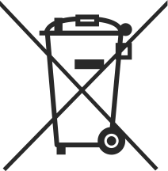

# VoiceToys are not toys, even though they are called that.

**Safety first!**

All VoiceToys devices are made of harmless materials and without sharp edges, in order to minimize the risk of injury. The devices are intended to be operated by therapists. **Do not give them to children for independent use!** Except for the **VibeY** device, which produces vibrations and is intended to be touched by the user, do not place the other devices in users' hands, in order to avoid accidental damage. Pay particular attention to the speakers from the **SpaceY** system, because their emitting surfaces are made of soft wood. Grip and hold them exclusively by the plastic part!

**Note on safety and user responsibility** 

This manual is intended to help you with the correct and safe use of this electronic device. Before using the device, read this manual carefully and follow all the stated guidelines. The manufacturer bears no responsibility for improper use of the device or for consequences that may arise from it.

**IMPORTANT!!! Do not attempt to repair the devices yourself, nor to open or disassemble them for any reason!**

In case of any problem with any part of the system, malfunction or breakage, contact the manufacturer directly or your local representative from whom you obtained the device. **The wireless devices from the VoiceToys system contain rechargeable lithium-ion batteries, which in case of incorrect handling can cause a fire!** Do not expose them to high temperatures or to direct sunlight! The devices must not come into contact with water!

**Disposal and recycling** 

The device housings are made of PET-G plastic, aluminum and cast acrylic. They also contain various electronic components and lithium-ion batteries. At the end of their life cycle, do not throw them into municipal waste, but contact your local recycling center or the device manufacturer directly.

---

### System overview

The VoiceToys system consists of four groups of devices and a mobile application.

*Devices from the VoiceToys system*

**SpreadY** is made up of 5 multifunctional, wirelessly interconnected columns. They are primarily intended for the visual representation of the spreading of the voice in space, but other functionalities can also be activated through the mobile application (memory game, analysis and synthesis of words and sentences, etc.).

**JumpY** is a light panel that shows the sound level or reacts to the change in the distance of an object from the wireless sensor that comes with the device. It is intended for the visual representation of sound intensity and for sensorimotor stimulation and exercise, using original games that are activated via the mobile application.

**VibeY** is a vibrotactile device that reacts to the intensity and pitch of sound by producing gentle rainbow-colored lights and mild vibrations. It is intended for the stimulation of vocalization and the control of voice pitch and intensity. The sensitivity can be controlled with the mobile application.

**SpaceY** are 5 smart speakers that serve for the identification and localization of sound in space. They are controlled exclusively with the mobile application.

---

### What is in the box?

The VoiceToys system comes in two boxes. In one are packed the **wireless** devices from the system, as separate devices, each in its own separate box, marked by colors:

- 1 piece - **VibeY**
- 5 pieces - **SpaceY** (blue, yellow, green, red, gray)
- 5 pieces - **SpreadY** (blue, yellow, green, red, gray)

Along with them come additional components for operation:

- 5 pieces of transparent rods for **SpreadY**
- 5 pieces of card holders for **SpreadY**
- 1 charging cable

In the second box comes the **JumpY** device, with its accompanying power supply and distance sensor - **JumpY** **Sensor**, which is also treated as a **wireless** device.

### Unpacking and setting up for operation

Take the wireless devices out of the box and place them in a horizontal position. Store the boxes in a safe place, in case of future transport or storage. If you consider that you do not need them, you can return them to the manufacturer for recycling.

The **JumpY** device is mounted on the wall, according to the instructions in the chapter devoted to detailed information about it.

### Powering the devices and electrical safety

All devices are powered by standard 5V/3A USB chargers using a cable with a USB-C connector. Do not use faulty or damaged cables, but only those supplied with the device or adequate quality replacements. During charging, DO NOT LEAVE THE DEVICES UNATTENDED! In case an unusually high device temperature occurs, smoke appears or unusual odors appear, IMMEDIATELY disconnect the device from the power and place it in a location where it cannot cause a fire! The wireless devices are charged and are intended to operate without connected power, while the **JumpY** device must be constantly connected to power because it does not contain batteries.

### Explanation of symbols

|    | The device is certified for safety according to the standards for the market of the Republic of Serbia.   |
| ------------------------------ | ---------------------------------------------------------------------------------- |
|    | The device is certified for safety according to the standards for the market of the European Union.     |
|  | Do not throw the device into municipal waste, but recycle it or send it to the manufacturer |

---

### Warnings

| Mark / Sign | Meaning                                                                                                                                                                                                |
| ------------- | ------------------------------------------------------------------------------------------------------------------------------------------------------------------------------------------------------- |
| ⚠️ Warning | Indicates the possibility of serious physical injury if the instructions in this manual are not followed correctly.                                                                                       |
| ▲ Caution       | Indicates the possibility of physical injury or material damage if the instructions are not followed correctly.                                                                                             |
| 🚫 Forbidden | A crossed-out circle indicates that something is forbidden. The explanation of the prohibition is located next to the symbol.                                                                                                            |
| 🚫📦          | Disassembly is not permitted!                                                                                                                                                                            |
| ❗             | **CAUTION:** The battery in the device is not replaceable and replacing it may pose a risk. Do not attempt to replace or disconnect it.                                                                     |
| ❗             | **CAUTION:** The products are not intended for use in flammable or explosive environments.                                                                                                              |
| ⚡             | **WARNING:** There is a risk of explosion or injury if the device is exposed to conductive materials, liquid, fire or high temperature (above 40°C).                                        |
| ❗             | **WARNING:** Do not use the device in a damp environment. Protect it from the ingress of liquid.                                                                                                              |
| ▲             | **WARNING:** The device must be powered by an external power supply that complies with the IEC/EN 62368-1 standard and meets the ES1 and PS1 requirements.                                                        |
| 🚫🔌          | **WARNING:** Danger of electric shock or fire. Charge the device exclusively with the supplied USB charger. The USB cable must be connected to a certified laptop/PC or a certified mini USB charger. |
| 🚫🛠️         | **WARNING:** Do NOT open the device housing. If it is determined that the housing has been opened, the warranty becomes void.                                                                                |

