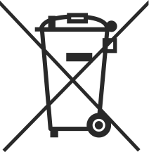

# VoiceToys to nie zabawki, choć tak się nazywają.

**Bezpieczeństwo przede wszystkim!**

Wszystkie urządzenia VoiceToys są wykonane z bezpiecznych materiałów i nie mają ostrych krawędzi, aby ograniczyć ryzyko urazów. Urządzenia są przeznaczone do obsługi przez terapeutów. **Nie dawaj ich dzieciom do samodzielnego używania!** Z wyjątkiem urządzenia **VibeY**, które wytwarza wibracje i jest przeznaczone do dotykania, nie dawaj pozostałych urządzeń do rąk podopiecznym, aby uniknąć przypadkowych uszkodzeń. Karty i obrazki na urządzeniach i w uchwytach na karty umieszcza terapeuta; dziecko je wybiera i kładzie przed urządzeniem. Szczególnie uważaj na głośniki systemu **SpaceY**, ponieważ ich powierzchnie emitujące dźwięk są wykonane z miękkiego drewna. Chwytaj je i trzymaj wyłącznie za plastikową część!

**Przeznaczenie produktu:** VoiceToys nie jest wyrobem medycznym w rozumieniu przepisów o wyrobach medycznych i nie jest przeznaczony do diagnozowania, leczenia, łagodzenia ani monitorowania chorób, urazów lub niepełnosprawności. VoiceToys to elektroniczny system stymulacji wielozmysłowej, przeznaczony dla specjalistów jako narzędzie wspomagające w praktyce logopedycznej, pedagogiki specjalnej, rehabilitacyjnej i edukacyjnej. Ocena, dobór postępowania oraz interpretacja postępów należą wyłącznie do specjalisty. Producent nie formułuje ani nie gwarantuje żadnych efektów terapeutycznych.

**Uwagi dotyczące bezpieczeństwa i odpowiedzialności użytkownika**

Niniejsza instrukcja ma pomóc w prawidłowym i bezpiecznym użytkowaniu tego urządzenia elektronicznego. Przed użyciem urządzenia uważnie przeczytaj instrukcję i stosuj się do wszystkich zawartych w niej wskazówek. Producent nie ponosi odpowiedzialności za niewłaściwe użytkowanie urządzenia ani za jego skutki.

**WAŻNE!!! Nie próbuj samodzielnie naprawiać urządzeń ani z jakiegokolwiek powodu ich otwierać lub demontować!**

W przypadku jakiegokolwiek problemu z dowolną częścią systemu, usterki lub uszkodzenia skontaktuj się bezpośrednio z producentem albo z lokalnym przedstawicielem, od którego kupiłeś urządzenie. **Bezprzewodowe urządzenia systemu VoiceToys zawierają akumulatory litowo-jonowe, które w razie niewłaściwego obchodzenia się z nimi mogą spowodować pożar!** Nie wystawiaj ich na działanie wysokiej temperatury ani bezpośredniego światła słonecznego! Urządzenia nie mogą mieć kontaktu z wodą!

**Utylizacja i recykling**

Obudowy urządzeń są wykonane z tworzywa PET-G, aluminium i pleksi. Zawierają też różne podzespoły elektroniczne i akumulatory litowo-jonowe. Po zakończeniu okresu użytkowania nie wyrzucaj ich do odpadów komunalnych, lecz skontaktuj się z lokalnym punktem recyklingu lub bezpośrednio z producentem.

---

### Przegląd systemu

System VoiceToys składa się z czterech grup urządzeń i aplikacji mobilnej.

*Urządzenia systemu VoiceToys*

**SpreadY** to 5 wielofunkcyjnych, bezprzewodowo połączonych ze sobą filarów. Służą przede wszystkim do wizualnego przedstawiania rozchodzenia się głosu w przestrzeni, ale za pomocą aplikacji mobilnej można uruchomić także inne funkcje (gra pamięciowa, analiza i synteza wyrazów i zdań itd.).

**JumpY** to panel świetlny, który pokazuje poziom dźwięku lub reaguje na zmianę odległości obiektu od dołączonego do urządzenia bezprzewodowego czujnika. Służy do wizualnego przedstawiania natężenia dźwięku oraz do stymulacji i ćwiczeń sensomotorycznych w autorskich grach uruchamianych z aplikacji mobilnej.

**VibeY** to urządzenie wibrotaktylne, które reaguje na natężenie i wysokość dźwięku łagodnym światłem w kolorach tęczy i delikatnymi wibracjami. Służy do stymulowania wokalizacji oraz kontroli wysokości i natężenia głosu. Czułość można regulować w aplikacji mobilnej.

**SpaceY** to 5 inteligentnych głośników do rozpoznawania i lokalizowania dźwięku w przestrzeni. Steruje się nimi wyłącznie za pomocą aplikacji mobilnej.

---

### Co jest w pudełku?

System VoiceToys jest dostarczany w dwóch pudełkach. W pierwszym znajdują się **bezprzewodowe** urządzenia systemu, każde w osobnym pudełku oznaczonym kolorem:

- 1 szt. – **VibeY**
- 5 szt. – **SpaceY** (niebieski, żółty, zielony, czerwony, szary)
- 5 szt. – **SpreadY** (niebieski, żółty, zielony, czerwony, szary)

Do nich dołączone są elementy dodatkowe:

- 5 szt. przezroczystych prętów do **SpreadY**
- 5 szt. uchwytów na karty do **SpreadY**
- 1 kabel do ładowania

W drugim pudełku znajduje się urządzenie **JumpY** wraz z zasilaczem i czujnikiem odległości **JumpY** – który również traktuje się jako urządzenie **bezprzewodowe**.

### Rozpakowanie i przygotowanie do pracy

Wyjmij urządzenia bezprzewodowe z pudełka i ustaw je w pozycji poziomej. Zachowaj pudełka w bezpiecznym miejscu – przydadzą się do transportu lub przechowywania urządzeń. Jeśli uważasz, że nie są ci potrzebne, możesz je zwrócić producentowi do recyklingu.

Urządzenie **JumpY** montuje się na ścianie zgodnie z instrukcją w rozdziale poświęconym temu urządzeniu.

### Zasilanie urządzeń i bezpieczeństwo elektryczne

Wszystkie urządzenia zasila się standardową ładowarką USB o napięciu 5 V i prądzie co najmniej 2 A, za pomocą kabla ze złączem USB-C. Nie używaj wadliwych ani uszkodzonych kabli, tylko kabli dostarczonych z urządzeniem lub odpowiednich zamienników dobrej jakości. Podczas ładowania NIE ZOSTAWIAJ URZĄDZEŃ BEZ NADZORU! Jeśli urządzenie nagrzeje się w nietypowy sposób, pojawi się dym lub nietypowy zapach, NATYCHMIAST odłącz je od zasilania i odłóż w miejsce, w którym nie może wywołać pożaru! Urządzenia bezprzewodowe mają akumulatory i po naładowaniu pracują bez podłączonego zasilania, natomiast urządzenie **JumpY** musi być stale podłączone do zasilania, ponieważ nie ma akumulatora.

### Objaśnienie symboli

|    | Urządzenie ma certyfikat bezpieczeństwa zgodny z normami obowiązującymi na rynku Republiki Serbii. |
| ------------------------------ | ---------------------------------------------------------------------------------- |
|    | Urządzenie ma certyfikat bezpieczeństwa zgodny z normami obowiązującymi na rynku Unii Europejskiej. |
|  | Nie wyrzucaj urządzenia do odpadów komunalnych; oddaj je do recyklingu lub odeślij producentowi. |

---

### Ostrzeżenia

| Oznaczenie / Sign | Znaczenie |
| ------------- | ------------------------------------------------------------------------------------------------------------------------------------------------------------------------------------------------------- |
| ⚠️ Ostrzeżenie | Wskazuje na możliwość poważnego urazu, jeśli instrukcje z tego podręcznika nie będą prawidłowo przestrzegane. |
| ▲ Uwaga       | Wskazuje na możliwość urazu lub szkody materialnej, jeśli instrukcje nie będą prawidłowo przestrzegane. |
| 🚫 Zakaz | Przekreślone koło oznacza, że coś jest zabronione. Wyjaśnienie zakazu znajduje się obok symbolu. |
| ⚠️             | **OSTRZEŻENIE — FOTOWRAŻLIWOŚĆ:** Urządzenia VoiceToys emitują efekty świetlne, w tym zmienne i migające światło. U osób z padaczką fotogenną lub skłonnością do napadów efekty świetlne mogą wywołać napad. Przed rozpoczęciem pracy sprawdź u rodzica lub opiekuna oraz w dokumentacji dziecka, czy występuje padaczka lub czy wcześniej wystąpiła reakcja na migające światło. Jeśli tak, używaj efektów świetlnych wyłącznie za zgodą lekarza prowadzącego dziecko, ze zmniejszonym natężeniem, bez najszybszych ustawień (największa prędkość w trybie Snoezelen, najmniejsza bezwładność lub opadanie), w dobrze oświetlonym pomieszczeniu i w większej odległości od panelu JumpY. Natychmiast przerwij pracę i wyłącz światła, jeśli zauważysz drgawki, nieruchome spojrzenie, przyspieszone mruganie, dezorientację lub utratę przytomności, i wezwij pomoc medyczną. |
| ⚠️             | **OSTRZEŻENIE — NADWRAŻLIWOŚĆ SENSORYCZNA:** Przed użyciem specjalista ocenia, czy dziecko nie jest nadwrażliwe na światło, dźwięk lub wibrację, i odpowiednio dostosowuje funkcje urządzeń. Zaczynaj od najniższego natężenia. Jeśli dziecko wykazuje oznaki przeciążenia, wyłącz światło, dźwięk lub wibrację i poczekaj, aż się uspokoi. |
| 🚫📦          | Demontaż urządzenia jest zabroniony! |
| ❗             | **UWAGA:** Akumulator w urządzeniu nie jest wymienny, a jego wymiana może stwarzać zagrożenie. Nie próbuj go wymieniać ani odłączać. |
| ❗             | **UWAGA:** Produkty nie są przeznaczone do używania w środowisku łatwopalnym lub zagrożonym wybuchem. |
| ⚡             | **OSTRZEŻENIE:** Istnieje ryzyko wybuchu lub urazu, jeśli urządzenie zostanie wystawione na działanie materiałów przewodzących, cieczy, ognia lub wysokiej temperatury (powyżej 40°C). |
| ❗             | **OSTRZEŻENIE:** Nie używaj urządzenia w wilgotnym otoczeniu. Chroń je przed dostaniem się cieczy do wnętrza. |
| ▲             | **OSTRZEŻENIE:** Urządzenie musi być zasilane z zewnętrznego zasilacza zgodnego z normą IEC/EN 62368-1 i spełniającego wymagania ES1 i PS1. |
| 🚫🔌          | **OSTRZEŻENIE:** Niebezpieczeństwo porażenia prądem lub pożaru. Ładuj urządzenie wyłącznie dostarczoną ładowarką USB. Kabel USB musi być podłączony do certyfikowanego laptopa/komputera lub certyfikowanej ładowarki USB. |
| 🚫🛠️         | **OSTRZEŻENIE:** NIE otwieraj obudowy urządzenia. Jeśli zostanie stwierdzone, że obudowa była otwierana, gwarancja traci ważność. |

