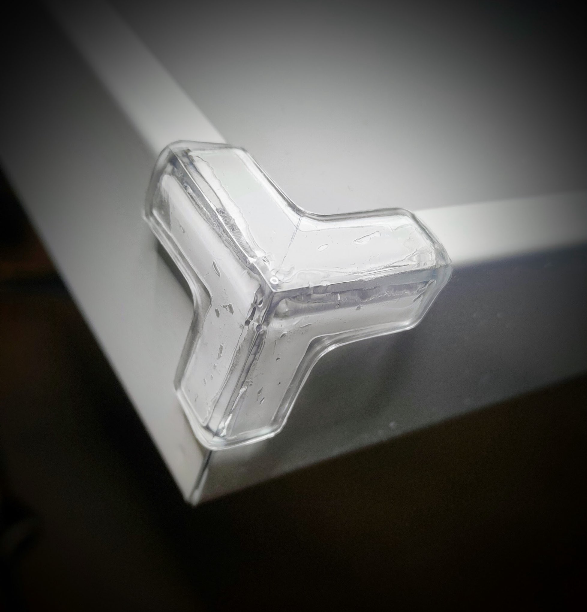

# Specyfikacja urządzenia

<FigureBlock
	src="/voice-toys/images/Jumped_-_semafor_2_alpha.png"

	alt="JumpY"
	imagePosition="right"
>

| Zasilanie    | DC, 5V, 2A                                                        |
| ------------ | ----------------------------------------------------------------- |
| Złącze       | USB-C                                                             |
| Łączność     | Wi-Fi, Bluetooth                                                  |
| JumpY        | panel świetlny                                                    |
| Wymiary      | 1200 mm x 300 mm                                                  |
| Obudowa      | Rama aluminiowa, płyty Forex, akryl ekstrudowany, pianka EVA |
| Czujnik JumpY | opcjonalny czujnik odległości |
| Wymiary      | Szerokość 70 mm Wysokość 50 mm Długość 45 mm            |
| Akumulator   | Li-Ion 18650                                                      |
| Obudowa      | PET-G                                                             |
</FigureBlock>
---

### Opis systemu i uwagi dotyczące bezpieczeństwa

JumpY to wielofunkcyjny panel świetlny o wymiarach 120 x 30 cm, przeznaczony przede wszystkim do stymulacji audiowizualnej i sensomotorycznej. Może reagować na poziom dźwięku dzięki wbudowanemu, bardzo czułemu mikrofonowi, a także łączyć się bezprzewodowo z dołączonym czujnikiem odległości. Jego liczne tryby pracy wybiera się w aplikacji mobilnej.

Panel świetlny nie jest przeznaczony do żadnego kontaktu fizycznego z użytkownikiem! Nie dotykaj ani nie uderzaj jego świecącej powierzchni!

### Uruchomienie systemu

Panel JumpY jest przeznaczony do montażu na ścianie. Instrukcja montażu znajduje się poniżej. Jeśli musisz często go przenosić, możesz na własną odpowiedzialność używać go bez mocowania. Nieprzymocowany panel ustaw tak, aby nie mógł się przewrócić: całą dolną krawędzią na podłodze, oparty o ścianę, z dala od miejsc, w których poruszają się dzieci. W zabawach z ruchem, skakaniem i piłką panel musi być przymocowany do ściany. Panel JumpY jest jedynym urządzeniem VoiceToys, które podczas pracy musi być podłączone do sieci elektrycznej. Dlatego przed użyciem upewnij się, że w pobliżu jest gniazdko. Urządzenie zasila się kablem ze złączem USB-C. Złącze znajduje się w prawej dolnej części panelu świetlnego, tuż pod przełącznikiem.

Podłącz kabel do standardowego zasilacza USB **o napięciu 5 V i prądzie co najmniej 2 A**, a zasilacz do gniazdka. Włącz przełącznik. Urządzenie uruchamia się, świecąc na czerwono. Po krótkiej inicjalizacji zaczyna pracować w trybie, w którym pracowało podczas poprzedniego użycia.

---

<FigureBlock
	src="/img/uputstvo/image-104.png"

	alt="Montaż JumpY"
	imagePosition="right"
>

MONTAŻ urządzenia. Całkowite wymiary urządzenia to 1200 x 300 mm.

Urządzenie mocuje się trzema wkrętami o średnicy łba 8 mm i trzpienia 5 mm, o długości co najmniej 100 mm.

Zgodnie z załączonym schematem wywierć otwory w ścianie i zamocuj w nich wkręty lub haczyki z kołkami rozporowymi. Następnie ostrożnie zawieś na nich urządzenie.

Zostaw wystarczająco dużo miejsca w prawej dolnej części na wtyczkę zasilania i dostęp do przełącznika.

</FigureBlock>

*Po montażu naklej dołączone samoprzylepne osłony na narożniki urządzenia.*

---

### Funkcje aplikacji mobilnej dla urządzenia JumpY

Wybór trybu pracy i szczegółowe ustawienia urządzenia wprowadza się w aplikacji VoiceToys. Przed uruchomieniem aplikacji koniecznie włącz urządzenie JumpY, aby mogło połączyć się z aplikacją. Urządzenia (panel świetlny i czujnik odległości) łączą się ze sobą automatycznie, bez dodatkowej konfiguracji, i reagują na dźwięk zaraz po włączeniu.

<FigureBlock
	src="/voice-toys/images/screenshots/pl/27-jumpy-zupcanik.jpg"

	alt="Informacje o urządzeniu JumpY"
	imagePosition="right"
>
*Ekran po naciśnięciu symbolu koła zębatego.*

Po włączeniu urządzenia wybierz na ekranie głównym aplikacji (opisanym w rozdziale [Aplikacja mobilna](/uputstvo/mobilna-aplikacija#ekran-główny)) **JumpY**, gdy jego symbol zmieni kolor na zielony. Jeśli połączenie się powiedzie, panel świetlny krótko zaświeci na niebiesko, a aplikacja wczyta ustawienia urządzenia i pokaże wartości, według których urządzenie aktualnie pracuje.

W górnym czerwonym pasku ekranu aplikacji widzisz nazwę urządzenia oraz przyciski informacji o systemie i pomocy.

**Naciśnięcie symbolu koła zębatego** w górnym czerwonym pasku otwiera ekran z informacjami o urządzeniu, na którym możesz sprawdzić, czy urządzenie jest zaktualizowane, czyli czy ma wgraną najnowszą wersję oprogramowania („Masz najnowszą wersję”).

Suwakiem **„Poziom dźwięku”** ustawiasz głośność dźwięków sygnalizujących poprawne i błędne odpowiedzi, a suwakiem **„Jasność”** – jasność panelu świetlnego.

Naciśnięcie dowolnego miejsca ekranu zacienionego na szaro przenosi z powrotem do ekranu urządzenia JumpY.

</FigureBlock>

Po naciśnięciu symbolu znaku zapytania pojawi się tekst, który przypomni podstawowe funkcje aplikacji dla JumpY. Tekst można przewijać w dół, aby przeczytać go do końca. Na dole ekranu znajduje się przycisk „Odtwórz wideo”.

Po jego naciśnięciu otworzysz szczegółową instrukcję wideo, która pokazuje pełną obsługę urządzenia JumpY.

Naciśnięcie przycisku „X” przenosi z powrotem do ekranu urządzenia JumpY, w trybie, z którego korzystałeś wcześniej.

---

### Tryby pracy urządzenia JumpY

Panel świetlny z czujnikiem odległości JumpY ma kilka trybów pracy o następującym przeznaczeniu:

<FigureBlock
	src="/voice-toys/images/screenshots/pl/21-jumpy-rezim.jpg"

	alt="Wybór trybu JumpY"
	imagePosition="right"
>
*Tryby pracy urządzenia JumpY: ekran po naciśnięciu przycisku „Tryb”.*

**Sprzężenie zwrotne** – światła na urządzeniu reagują na dźwięk z mikrofonu lub na sygnał z czujnika odległości

**Gra w klaskanie** – autorska gra do ćwiczenia skupienia, cierpliwości, szybkości reakcji i motoryki dużej

**Różnice** – ćwiczenie rozpoznawania kolorów i pojęć „taki sam” – „inny”

**Wzór rytmiczny** – rozpoznawanie i powtarzanie wzorów rytmicznych

**Fonetyka** – ćwiczenie formantów i sybilantów (głosek syczących, szumiących i ciszących)

**Snoezelen** – uspokajające, wielobarwne światła
</FigureBlock>

Tryb wybiera się przyciskiem **„Tryb”** w prawym rogu dolnego czerwonego paska ekranu aplikacji. Na obrazku obok widać ekran po naciśnięciu przycisku **„Tryb”**. Po dotknięciu nazwy wybranego trybu pojawi się ekran szczegółowych ustawień tego trybu.

Poniżej opisano, jak wybrać i jak używać każdego z tych trybów.

---

### Sprzężenie zwrotne

 - Reakcja na dźwięk

Po wejściu do menu wyboru trybu przyciskiem **„TRYB”** tryb wizualnej identyfikacji poziomu dźwięku i odległości wybierasz przyciskiem **„Sprzężenie zwrotne”**. Pojawi się ekran pokazany na obrazku poniżej, w którego górnym czerwonym pasku widzisz nazwę urządzenia oraz przyciski informacji o systemie i pomocy. Działanie tych przycisków opisano w sekcji [Funkcje aplikacji mobilnej](#funkcje-aplikacji-mobilnej-dla-urządzenia-jumpy).

<FigureBlock
	src="/voice-toys/images/screenshots/pl/18b-jumpy-izvor-i-prikaz.jpg"

	alt="Źródło i sposób wyświetlania"
	imagePosition="left"
>

Na środku ekranu aplikacji znajdują się obrazki pokazujące źródło sygnału (lewy) i sposób wyświetlania na panelu świetlnym (prawy). Wygląd tej części ekranu pokazuje obrazek obok. Dopóki czujnik odległości nie jest włączony, lewy obrazek pokazuje źródło **„Dźwięk”** z symbolem mikrofonu. Przy tych ustawieniach panel świetlny reaguje na dźwięk.

</FigureBlock>

<FigureBlock
	src="/voice-toys/images/screenshots/pl/19-jumpy-izaberite-ekran.jpg"

	alt="Wybór sposobu wyświetlania"
	imagePosition="right"
>

Prawy obrazek na środku ekranu aplikacji pokazuje aktualny sposób wyświetlania na panelu świetlnym. Po jego dotknięciu otwiera się okno **„Wybierz ekran”**, w którym możesz zmienić wygląd panelu:

**„Tęcza”** – suwakiem **Opadanie** regulujesz szybkość opadania reakcji świetlnej na dźwięk.

**„Pola”** – oprócz suwaka **Opadanie** pojawia się suwak **Pola**. Określa on, na ile kolorowych pól zostanie podzielony obraz na panelu świetlnym.

**„Szczyt”** – oprócz suwaka **Opadanie** pojawiają się dwa dodatkowe suwaki. Pierwszy określa, jak szybko opada szczyt, czyli czerwona linia pokazująca maksymalny osiągnięty poziom dźwięku. Drugi określa, jak długo szczyt pozostaje w miejscu, zanim zacznie opadać.

**„Okno”** – oba suwaki szczytu działają tak samo jak w poprzednim przypadku, a „szczyt” oznacza tu białą linię pokazującą poziom dźwięku.

</FigureBlock>

<FigureBlock
	src="/voice-toys/images/screenshots/pl/18-jumpy-mikrofon.jpg"

	alt="JumpY, sprzężenie zwrotne z dźwiękiem"
	imagePosition="right"
>

*Wygląd ekranu aplikacji: stan połączenia, presety, źródło i sposób wyświetlania, suwaki.*

Poziom dźwięku, czułość i bezwładność reakcji świetlnej ustawia się suwakami w dolnej połowie ekranu aplikacji, w zakładce **„Źródło”**.

**Poziom dźwięku** to próg, który dźwięk musi przekroczyć, aby wywołać reakcję świetlną. Dźwięki poniżej tego poziomu są ignorowane. W razie potrzeby dostosuj go do poziomu hałasu w pomieszczeniu tak, aby panel świetlny nie zapalał się, gdy nikt nie mówi.

**Czułość** to wrażliwość systemu na zmianę poziomu dźwięku. Gdy zwiększasz jej wartość, system staje się czulszy i łatwiej go pobudzić. Gdy przesuwasz suwak w stronę niższych wartości, do uruchomienia urządzenia, czyli zapalenia świateł, potrzebny jest wyższy poziom dźwięku.

**Bezwładność** określa szybkość reakcji panelu świetlnego na bodziec dźwiękowy.

</FigureBlock>
---

- Reakcja na czujnik odległości

<FigureBlock
	src="/voice-toys/images/senzor-removebg-preview-1.png"
	alt="Czujnik odległości"
	imagePosition="left"

>

*Czujnik odległości*

Gdy czujnik odległości jest włączony, panel świetlny przestaje reagować na dźwięk i reaguje tylko na zmianę odległości między czujnikiem a obiektem. Na ekranie aplikacji pojawia się wtedy napis **„Czujnik”** z odpowiednim symbolem, a w dolnej części ekranu suwak **„Zakres”**. Reguluje on czułość obrazu świetlnego na zmianę odległości przeszkody od czujnika. Im mniejsza wartość na suwaku, tym szybciej światła na panelu reagują i tym bardziej wypełniają panel.

**Czujnika odległości możesz używać także w trybach Gra w klaskanie, Różnice i Wzór rytmiczny. Wtedy przesunięcie dłoni przed czujnikiem zastępuje klaśnięcie lub inny głośny, ostry dźwięk.**

Gdy czujnik odległości zostanie wyłączony, aplikacja i wszystkie jej funkcje oraz panel świetlny automatycznie wracają do źródła „Dźwięk”, czyli znów reagują na dźwięk.

 </FigureBlock>

<FigureBlock
	src="/voice-toys/images/screenshots/pl/20-jumpy-senzor.jpg"
	alt="JumpY z czujnikiem odległości"
	imagePosition="right"
>

*Ekran po włączeniu czujnika odległości.*

Czujnik odległości włącz dopiero po ustawieniu go w maksymalnej odległości od obiektu, od którego chcesz mierzyć odległość. W chwili włączenia czujnik mierzy odległość początkową, a wszystkie zmiany odległości są pokazywane względem niej.

Ustaw go tak, aby strona czujnika z okrągłymi otworami była skierowana na obiekt, od którego mierzona jest odległość. Na przykład: jeśli umieszczasz czujnik pod trampoliną, dwa okrągłe otwory powinny być skierowane do góry, jak pokazano na obrazku.

Na ekranie aplikacji widać stan naładowania akumulatora czujnika odległości. Nie czekaj, aż akumulator całkowicie się rozładuje – naładuj go, podłączając kabel USB-C do gniazda oznaczonego strzałką na obrazku poniżej.

</FigureBlock>

Zawsze możesz wrócić do ekranu głównego aplikacji **„VoiceToys”**, naciskając przycisk z ikoną domku na środku dolnego czerwonego paska ekranu aplikacji.

---
### Gra w klaskanie
<FigureBlock
	src="/voice-toys/images/screenshots/pl/23-jumpy-igra-tapsanja.jpg"
	alt="JumpY, Gra w klaskanie"
	imagePosition="right"
>

*Ekran po uruchomieniu trybu Gra w klaskanie*

Po wejściu do menu wyboru trybu przyciskiem **„TRYB”** tryb Gra w klaskanie wybierasz przyciskiem **„Gra w klaskanie”**. Pojawi się ekran pokazany na obrazku obok, w którego górnym czerwonym pasku widzisz nazwę urządzenia oraz przyciski informacji o systemie i pomocy. Działanie tych przycisków opisano w sekcji [Funkcje aplikacji mobilnej](#funkcje-aplikacji-mobilnej-dla-urządzenia-jumpy).

Na środku ekranu lewy obrazek pokazuje źródło sygnału („Dźwięk” lub „Czujnik”), a prawy – wybrany tryb.

Czułość urządzenia na dźwięk ustawia się suwakiem w dolnej połowie ekranu aplikacji, w sekcji **„Ustawienia”**.

**Czułość** to wrażliwość systemu na nagły wzrost poziomu dźwięku. Taki nagły wzrost wywołuje głośny, ostry dźwięk – klaśnięcie, tupnięcie, uderzenie ołówkiem o stół, piłką o podłogę, w bębenek itd. Więcej informacji o zasadach gry znajdziesz po naciśnięciu symbolu znaku **zapytania** w prawej części górnego czerwonego paska.

**Reset** to przycisk oznaczony symbolem ↻. Jego naciśnięcie przywraca grę do stanu początkowego.

Jasność panelu ustawiasz suwakiem **„Jasność”** na ekranie, który otwiera się po naciśnięciu koła zębatego w górnym czerwonym pasku.

</FigureBlock>

Jeśli zmienisz parametry, **możesz zapisać swoje ustawienia** i korzystać z nich w sposób opisany w rozdziale [SpreadY, tryb Dźwięk](/uputstvo/spready#tryb-dźwięk).

Zawsze możesz wrócić do ekranu głównego aplikacji **„VoiceToys”**, naciskając przycisk z ikoną domku na środku dolnego czerwonego paska ekranu aplikacji.

---
### Różnice

<FigureBlock
	src="/voice-toys/images/screenshots/pl/24-jumpy-razlike.jpg"
	alt="JumpY, Różnice"
	imagePosition="right"
>

*Ekran po uruchomieniu trybu Różnice.*

Po wejściu do menu wyboru trybu przyciskiem „TRYB” tryb Różnice – ćwiczenie rozpoznawania kolorów – wybierasz przyciskiem **„Różnice”**. Pojawi się ekran pokazany na obrazku obok, w którego górnym czerwonym pasku widzisz nazwę urządzenia oraz przyciski informacji o systemie i pomocy. Działanie tych przycisków opisano w sekcji [Funkcje aplikacji mobilnej](#funkcje-aplikacji-mobilnej-dla-urządzenia-jumpy).

Czułość urządzenia na dźwięk ustawia się suwakami w dolnej połowie ekranu aplikacji, w sekcji **„Ustawienia”**.

**Czułość** to wrażliwość systemu na nagły wzrost poziomu dźwięku. Taki nagły wzrost wywołuje głośny, ostry dźwięk – klaśnięcie, tupnięcie, uderzenie ołówkiem o stół, piłką o podłogę, w bębenek itd. Więcej informacji o zasadach gry znajdziesz po naciśnięciu symbolu znaku **zapytania** w prawej części górnego czerwonego paska.

**Czas podwójnego klaśnięcia** określa maksymalny odstęp czasu między dwoma uderzeniami, które system rozpozna jako podwójne uderzenie.

Jasność panelu ustawiasz suwakiem **„Jasność”** na ekranie, który otwiera się po naciśnięciu koła zębatego w górnym czerwonym pasku.

</FigureBlock>

Jeśli zmienisz parametry, możesz zapisać swoje ustawienia i korzystać z nich w sposób opisany w rozdziale [SpreadY, tryb Dźwięk](/uputstvo/spready#tryb-dźwięk).

Zawsze możesz wrócić do ekranu głównego aplikacji **„VoiceToys”**, naciskając przycisk z ikoną domku na środku dolnego czerwonego paska ekranu aplikacji.

---
### Wzór rytmiczny

Po wejściu do menu wyboru trybu przyciskiem **„TRYB”** tryb rozpoznawania i powtarzania wzorów rytmicznych wybierasz przyciskiem **„Wzór rytmiczny”**. Pojawi się ekran pokazany na obrazku obok, w którego górnym czerwonym pasku widzisz nazwę urządzenia oraz przyciski informacji o systemie i pomocy. Działanie tych przycisków opisano w sekcji [Funkcje aplikacji mobilnej](#funkcje-aplikacji-mobilnej-dla-urządzenia-jumpy).

<FigureBlock
	src="/voice-toys/images/screenshots/pl/25-jumpy-ritmicki-obrazac.jpg"
	alt="JumpY, Wzór rytmiczny"
	imagePosition="right"
>

*Ekran po uruchomieniu trybu Wzór rytmiczny.*

Nad suwakami znajduje się przycisk ze strzałką, który określa, w którą stronę porusza się biała linia, oraz przycisk ↻, który resetuje grę i przywraca ją do początku.

Urządzenie ustawia się za pomocą elementów w dolnej połowie ekranu aplikacji.

Przełącznikiem **Łatwy – Średni – Trudny** wybierasz szerokość linii, utrudniając lub ułatwiając graczowi zadanie.

**Prędkość** to szybkość ruchu białej linii. Jej ustawieniem utrudniasz lub ułatwiasz graczowi zadanie.

**Czułość** to wrażliwość systemu na nagły wzrost poziomu dźwięku. Taki nagły wzrost wywołuje głośny, ostry dźwięk – klaśnięcie, tupnięcie, uderzenie ołówkiem o stół, piłką o podłogę, w bębenek itd. Więcej informacji o zasadach gry znajdziesz po naciśnięciu symbolu znaku **zapytania** w prawej części górnego czerwonego paska.

Jasność panelu ustawiasz suwakiem **„Jasność”** na ekranie, który otwiera się po naciśnięciu koła zębatego w górnym czerwonym pasku.

</FigureBlock>

Jeśli zmienisz któryś z parametrów, możesz zapisać swoje ustawienia i korzystać z nich w sposób opisany w rozdziale [SpreadY, tryb Dźwięk](/uputstvo/spready#tryb-dźwięk).

Zawsze możesz wrócić do ekranu głównego aplikacji **„VoiceToys”**, naciskając przycisk z ikoną domku na środku dolnego czerwonego paska ekranu aplikacji.

---

### Fonetyka

<FigureBlock
	src="/voice-toys/images/screenshots/pl/26-jumpy-fonetika.jpg"
	alt="JumpY, Fonetyka"
	imagePosition="right"
>

*Ekran po uruchomieniu trybu Fonetyka.*

Po wejściu do menu wyboru trybu przyciskiem **„TRYB”** tryb Fonetyka – ćwiczenie formantów i sybilantów – wybierasz przyciskiem **„Fonetyka”**. Pojawi się ekran pokazany na obrazku obok, w którego górnym czerwonym pasku widzisz nazwę urządzenia oraz przyciski informacji o systemie i pomocy. Działanie tych przycisków opisano w sekcji [Funkcje aplikacji mobilnej](#funkcje-aplikacji-mobilnej-dla-urządzenia-jumpy).

Na środku ekranu znajduje się obrazek pokazujący, w jakim trybie pracuje urządzenie.

Urządzenie ustawia się suwakami w dolnej połowie ekranu aplikacji, w sekcji **„Ustawienia”**.

Suwakiem **Próg formantów** wybierasz próg, który dźwięk musi przekroczyć, aby wywołać reakcję świetlną. Dźwięki poniżej tego poziomu są ignorowane.

Suwakiem **Próg sybilantów** wybierasz próg, który dźwięk musi przekroczyć, aby wywołać reakcję świetlną. Dźwięki poniżej tego poziomu są ignorowane.

**Czułość** to wrażliwość systemu na zmianę poziomu dźwięku. Gdy zwiększasz jej wartość, system staje się czulszy i łatwiej go pobudzić. Gdy przesuwasz suwak w stronę niższych wartości, do uruchomienia urządzenia, czyli zapalenia świateł, potrzebny jest wyższy poziom dźwięku.

Jasność panelu ustawiasz suwakiem **„Jasność”** na ekranie, który otwiera się po naciśnięciu koła zębatego w górnym czerwonym pasku.
</FigureBlock>
Jeśli zmienisz któryś z parametrów, możesz zapisać swoje ustawienia i korzystać z nich w sposób opisany w rozdziale [SpreadY, tryb Dźwięk](/uputstvo/spready#tryb-dźwięk).

Zawsze możesz wrócić do ekranu głównego aplikacji **„VoiceToys”**, naciskając przycisk z ikoną domku na środku dolnego czerwonego paska ekranu aplikacji.

---

### Snoezelen

<FigureBlock
	src="/voice-toys/images/screenshots/pl/22-jumpy-snoezelen.jpg"
	alt="JumpY, Snoezelen"
	imagePosition="right"
>

*Ekran po uruchomieniu trybu Snoezelen.*

Po wejściu do menu wyboru trybu przyciskiem **„TRYB”** tryb uspokajającego światła Snoezelen wybierasz przyciskiem **„Snoezelen”**. Pojawi się ekran pokazany na obrazku obok, w którego górnym czerwonym pasku widzisz nazwę urządzenia oraz przyciski informacji o systemie i pomocy. Działanie tych przycisków opisano w sekcji [Funkcje aplikacji mobilnej](#funkcje-aplikacji-mobilnej-dla-urządzenia-jumpy).

Układ kolorów, prędkość i liczbę wyświetlanych kolorów ustawia się suwakami w dolnej połowie ekranu aplikacji, w sekcji **„Ustawienia”**.

**Wzór** to wybór sposobu wyświetlania uspokajającego światła, czyli układu kolorów. Do wyboru jest 8 sposobów wyświetlania, które wybierasz tym suwakiem.

**Prędkość** to szybkość zmiany świateł w aktualnie wybranym wzorze. Możesz ją zwiększyć lub zmniejszyć.

**Kolory** to liczba kolorów, które pojawiają się w wybranym wzorze.

Jasność panelu ustawiasz suwakiem **„Jasność”** na ekranie, który otwiera się po naciśnięciu koła zębatego w górnym czerwonym pasku.

</FigureBlock>

Jeśli zmienisz parametry, możesz zapisać swoje ustawienia i korzystać z nich w sposób opisany w rozdziale [SpreadY, tryb Dźwięk](/uputstvo/spready#tryb-dźwięk).

Zawsze możesz wrócić do ekranu głównego aplikacji **„VoiceToys”**, naciskając przycisk z ikoną domku na środku dolnego czerwonego paska ekranu aplikacji.
