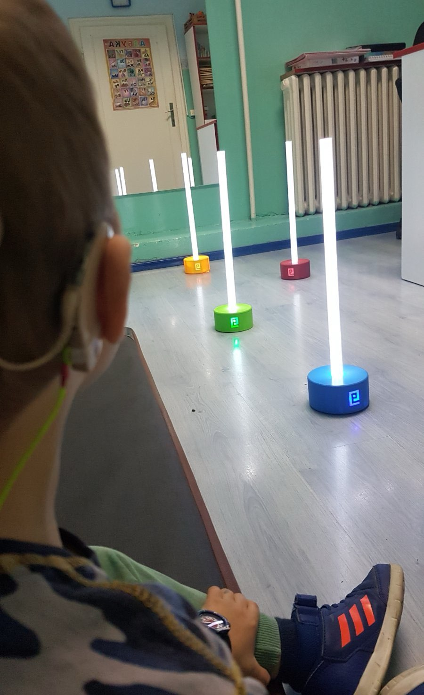

Hvala na poverenju!

Uređaj SpreadY u toku rada Namenjen je za rad u logopedskoj i defektološkoj praksi, ali se može koristiti u radu sa korisnicima svih uzrasta i nivoa razvoja.

Razvijan je sa ljubavlju i željom da se uklopi u proces rada tako da ga ne ometa, već da motiviše, ubrza napredovanje i olakša rad terapeuta.

Dizajniran je da bude lak za upotrebu, vizuelno sveden, jednostavnih oblika i jasnih, živih boja, neobičan, ali prirodan i human. Napravljen je od neškodljivih, kvalitetnih materijala.

Kontroliše se bežično, originalnom aplikacijom razvijenom za Android i iOS uređaje.

Zasnovan je na mikrokontrolerima kojima se veoma lako, bežično ažurira operativni sistem. Zahvaljujući tome, uređaji se mogu modifikovati i obogatiti dodatnim funkcijama prema zahtevima korisnika. Pozivamo vas da svojim idejama učestvujete u razvoju i napretku ovog jedinstvenog sistema!

Sistem Voice Toys je napravljen sa željom da ga korisnici zavole

