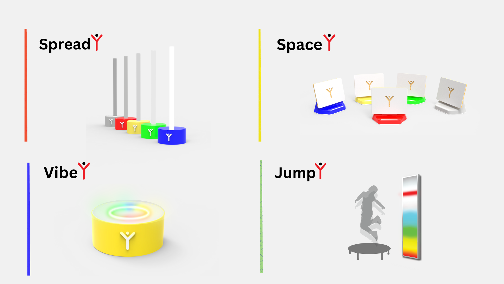
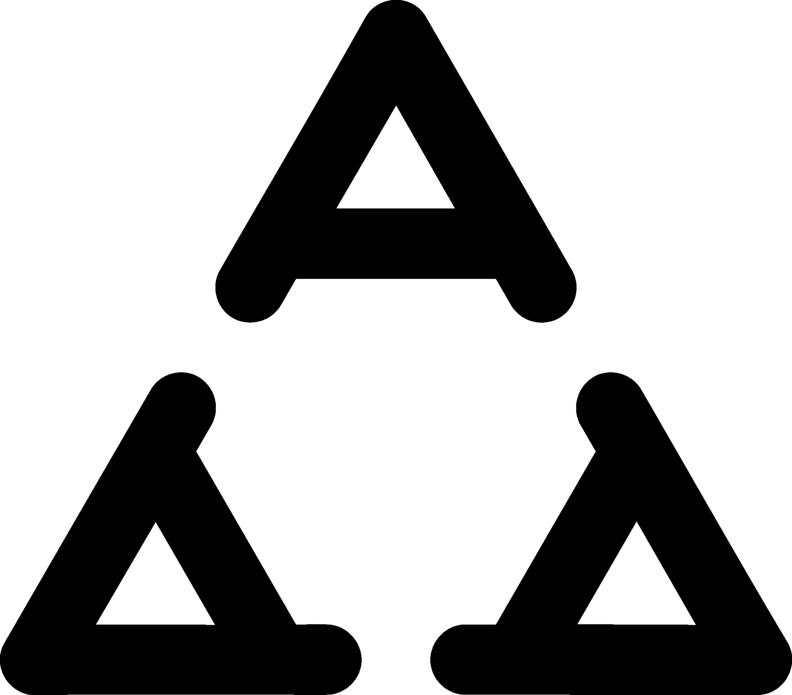
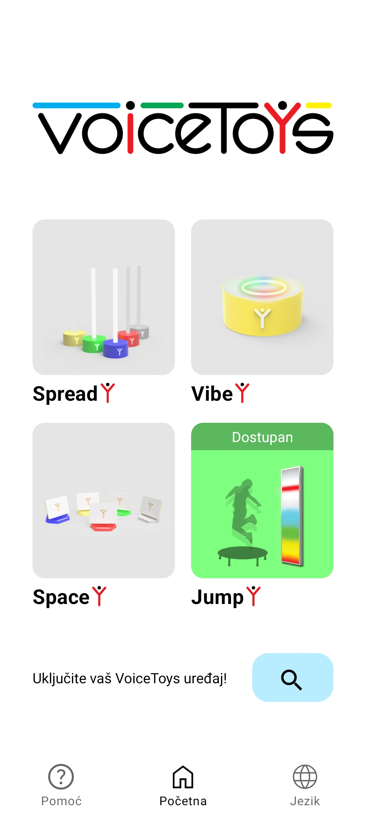

**Bezbednost pre svega!**

VoiceToys nisu igračke, iako se tako zovu.

**VoiceToys uređaje nemojte davati deci na samostalno korišćenje!**

Svi VoiceToys uređaji su napravljeni od neškodljivih materijala i bez oštrih ivica kako bi se minimizovala opasnost od povreda. Uređaji su namenjeni da njima rukuju terapeuti. Osim uređaja VibeY, koji proizvodi vibracije i namenjen je da ga korisnik dodiruje, ostale uređajte nemojte davati korisnicima u ruke kako bi se izbegla slučajna oštećenja. Posebno obratite pažnju na zvučnike iz sistema SpaceY, jer su njihove emitujuće površine napravljene od mekanog drveta. Hvatajte ih i držite isključivo za plastični deo!

**Napomena o sigurnosti i odgovornosti korisnika** 

Ovo uputstvo je namenjeno da vam pomogne u pravilnoj i bezbednoj upotrebi ovog elektronskog uređaja. Pre korišćenja uređaja, pažljivo pročitajte ovo uputstvo i pridržavajte se svih navedenih smernica. Proizvođač ne snosi odgovornost za nepropisnu upotrebu uređaja ili posledice koje mogu proisteći iz iste.

**VAŽNO!!! Uređaje ne pokušavajte da popravljate sami, niti da ih iz bilo kog razloga otvarate ili rasklapate!**

U slučaju bilo kakvog problema sa bilo kojim delom sistema, kvara ili loma, obratite se direktno proizvođaču ili vašem lokalnom predstavniku od kog ste nabavili uređaj. **Bežični uređaji iz sistema VoiceToys sadrže punjive litijum-jonske baterije, koje u slučaju pogrešnog rukavanja mogu izazvati požar!** Ne izlažite ih visokim temperaturama niti direktnoj sunčevoj svetlosti! Uređaji ne smeju doći u kontakt s vodom!

**Odlaganje i reciklaža** 

Kućišta uređaja su napravljen od PET-G plastike, aluminijuma i klirita. Sadrže i razne elektronske komponente i litijum-jonske baterije. U slučaju kraja životnog ciklusa, nemojte ih bacati u komunalni otpad, već se obratite vašem lokalnom reciklažnom centru ili direktno proizvođaču uređaja.

---

### Pregled sistema

Sistem VoiceToys sastoji se od četiri grupe uređaja i mobilne aplikacije.

**SpreadY** čini 5 višenamenskih međusobno bežično povezanih stubića. Prevashodno su namenjeni vizuelnoj reprezentaciji prostiranja glasa u prostoru, ali se kroz mobilnu aplikaciju mogu aktivirati i druge funkcionalnosti (igra memorije, analiza i sinteza reči i rečenica, itd.).

**JumpY** je svetlosni panel koji pokazuje nivo zvuka ili reaguje na promenu udaljenosti objekta od bežičnog senzora koji dolazi uz uređaj. Namenjen je za vizuelnu reprezentaciju jačine zvuka i senzomotornu stimulaciju i vežbanje, korišćenjem originalnih igara koje se aktiviraju putem mobilne aplikacije.

**VibeY** je vibrotaktilni uređaj koji reaguje na intentzitet i visinu zvuka proizvodeći nežna svetla duginih boja i blage vibracije. Namenjen je za stimulaciju glasanja i kontrolu visine i intenziteta glasa. Osetljivost se može kontrolisati mobilnom aplikacijom.

**SpaceY** su 5 pametnih zvučnika koji služe za identifikaciju i lokalizaciju zvuka u prostoru. Kontrolišu se isključivo mobilnom aplikacijom.

### Uređaji iz sistema VoiceToys

Koji su elementi sistema i čemu su namenjeni?

---

### Sadržaj i bezbednosne napomene

### Šta je u kutiji?

Sistem VoiceToys dolazi u dve kutije. U jednoj su zapakovani **bežični** uređaji iz sistema, kao posebni uređaji, svaki u svojoj posebnoj kutiji, označenoj po bojama:

- 1 komad - **VibeY**
- 5 komada - **SpaceY** (plava, žuta, zelena, crvena, siva)
- 5 komada - **SpreadY** (plava, žuta, zelena, crvena, siva)

Uz njih dolaze i dodatne komponente za rad:

- 5 komada providnih šipki za SpreadY
- 5 komada nosača za kartice za SpreadY
- 1 kabl za punjenje

U drugoj kutiji dolazi uređaj JumpY, sa pripadajućim napajanjem i senzorom udaljenost - JumpY Senzor, koji se takođe tretira kao bežični uređaj.

### Raspakivanje i postavljanje za rad

Bežične uređaje izvadite iz kutije i postavite u horizontalni položaj. Kutije odložite na bezbedno mesto, za slučaj budućeg transporta ili odlaganja. Ukoliko smatrate da vam nisu potrebne, možete ih vratiti proizvođaču na reciklažu.

Uređaj **JumpY** se postavlja na zid, prema uputstvu u poglavlju namenjenom detaljnim informacijama o njemu.

### Napajanje uređaja i električna bezbednost

Svi uređaji se napajaju standardnim USB punjačima od 5V/3A pomoću kabla sa USB-C priključkom. Ne koristite neispravne ili oštećene kablove, već samo one koji su vam isporučeni uz uređaj ili adekvatne kvalitetne zamene. Tokom punjenja NE OSTAVLJAJTE UREĐAJE BEZ NADZORA! U slučaju eventualne pojave neuobičajeno visoke temperature uređaja, pojave dima ili neuobičajenih mirisa uređaj ODMAH isključite iz struje i odložite na mesto na kom ne može izazvati požar! Bežični uređaji se pune i namenjeni su za rad bez priključenog napajanja, dok uređaj **JumpY** mora da bude konstantno priključen na napajanje jer ne sadrži baterije.

### Objašnjenje simbola

|    | Uređaj je sertifikovan za bezbednost po standardima za tržište Republike Srbije.   |
| ------------------------------ | ---------------------------------------------------------------------------------- |
|    | Uređaj je sertifikovan za bezbednost po standardima za tržište Evropske Unije.     |
|  | Uređaj ne bacajte u komunalni otpad, već ga reciklirajte ili pošaljite proizvođaču |

---

### Upozorenja

| Oznaka / Sign | Značenje                                                                                                                                                                                            |
| ------------- | --------------------------------------------------------------------------------------------------------------------------------------------------------------------------------------------------- |
| ⚠️ Upozorenje | Pokazuje mogućnost ozbiljne fizičke povrede ako se uputstva iz ovog priručnika ne prate pravilno.                                                                                                   |
| ▲ Oprez       | Pokazuje mogućnost fizičke povrede ili materijalne štete ako se uputstva ne prate pravilno.                                                                                                         |
| 🚫 Zabranjeno | Precrtani krug pokazuje da je nešto zabranjeno. Objašnjenje zabrane nalazi se pored simbola.                                                                                                        |
| 🚫📦          | Nije dozvoljeno rasklapanje!                                                                                                                                                                        |
| ❗             | OPREZ: Baterija u uređaju nije zamenjiva i njena zamena može izazvati rizik. Ne pokušavajte da je zamenite ili isključite.                                                                     |
| ❗             | OPREZ: Proizvodi nisu namenjeni za upotrebu u zapaljivim ili eksplozivnim okruženjima.                                                                                                              |
| ⚡             | UPOZORENJE: Postoji rizik od eksplozije ili povrede ako je uređaj izložen provodnim materijalima, tečnosti, vatri ili visokoj temperaturi (iznad 40°C).                                        |
| ❗             | UPOZORENJE: Ne koristite uređaj u vlažnom okruženju. Zaštitite ga od prodora tečnosti.                                                                                                              |
| ▲             | UPOZORENJE: Uređaj mora biti napajan eksternim napajanjem koje je usklađeno sa IEC/EN 62368-1 standardom i ispunjava ES1 i PS1 zahteve.                                                        |
| 🚫🔌          | UPOZORENJE: Opasnost od strujnog udara ili požara. Uređaj punite isključivo isporučenim USB punjačem. USB kabl mora biti povezan na sertifikovani laptop/PC ili sertifikovani mini USB punjač. |
| 🚫🛠️         | UPOZORENJE: NE otvarajte kućište uređaja. Ukoliko se utvrdi da je kućište otvoreno, garancija prestaje da važi.                                                                                |

---

### Mobilna aplikacija - namena i instalacija

### 1 - 1: Namena

Mobilna aplikacija "VoiceToys" je namenjena za kontrolu, pamćenje parametara i ažuriranje uređaja.

### 1 - 2: Instalacija

Ukoliko koristite Android uređaj, aplikaciju možete preuzeti sa Google Play Store-a, odnosno skeniranjem QR koda na kutiji u kojoj ste dobili uređaj.

Za instalaciju aplikacije potrebna su odobrenja za korišćenje lokacije i bluetooth- a. Prilikom instaliranja, dobićete notifikacije na kojima je potrebno da odobrite pristup traženim funkcijama telefona. Nakon odobrenja, aplikacija se instalira na uobičajeni način i može se naći među ostalim aplikacijama na vašem uređaju, pod imenom VoiceToys i sa našim logotipom.

**Tokom upotrebe neophodno je da bluetooth komunikacija, notifikacije i lokacija na vašem telefonu budu uključene.**

### 1 - 3: Početni ekran

Nakon pokretanja aplikacije počinje pretraga uređaja raspoloživih za povezivanje. **Nakon završene pretrage, zelenim okvirom biće istaknute slike prisutnih, odnosno uključenih uređaja kojima možete pristupiti. Pritiskom na sliku željenog uređaja, povezujete se sa njim i prelazite na ekran za kontrolu istog.** Pritiskom na logo VoiceToys dolazite na naš sajt gde možete naći kontakt za podršku i sve potrebne informacije. Nakon završene pretrage uređaja, možete ponoviti proces pritiskom na simbol koji prikazuje lupu.

*Početni ekran mobilne aplikacije.*

*Uređaj **JumpY** spreman za povezivanje.*
