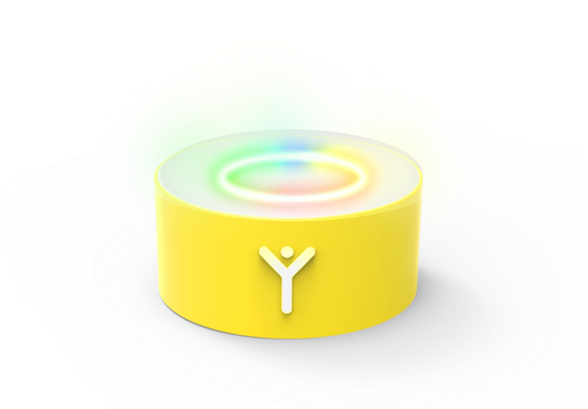
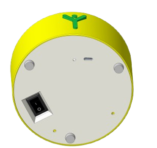
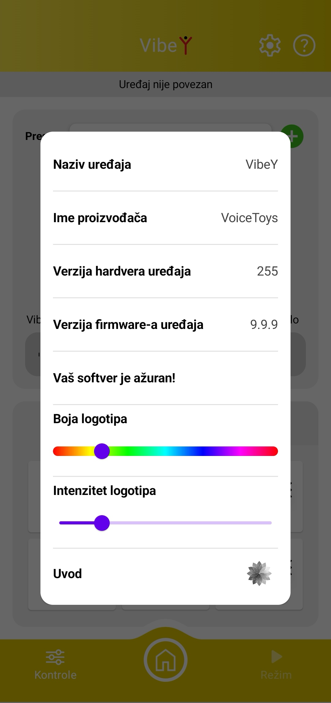
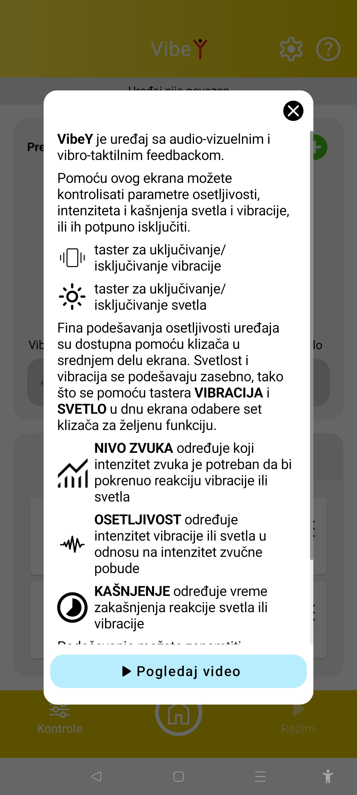
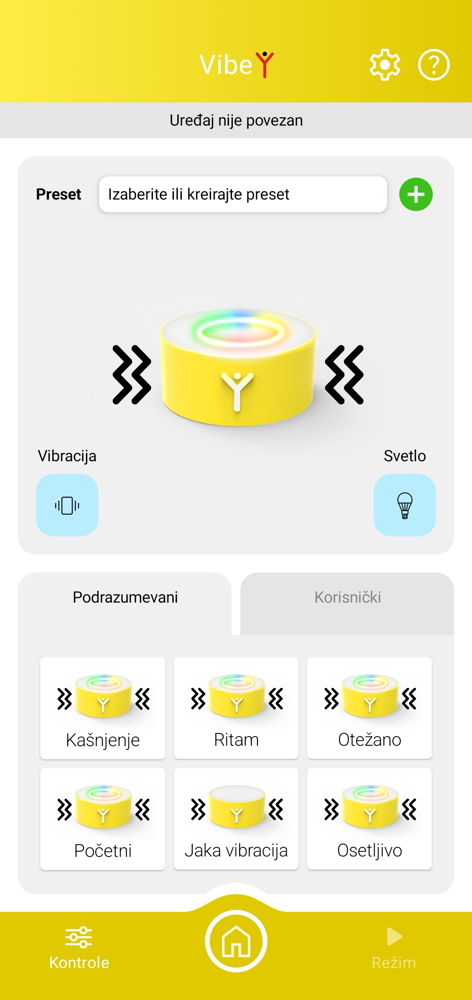
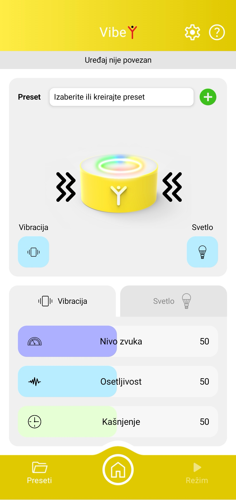

---

### Specifikacije uređaja

| Napajanje | DC, 5V, 3A                      |
| --------- | ------------------------------- |
| Konektor  | USB-C                           |
| Dimenzije | Prečnik 121mm Visina 60 mm |
| Baterija  | Li-Ion 18650                    |
| Mreže     | Wi-Fi, Bluetooth                |
| Kućište   | PET-G ekstrudirani akril   |

---

### 2 - 1: Opis uređaja i bezbednosne napomene

**VibeY** je vibrotaktilna, svetleća kutija, namenjena za stimulaciju glasanja i kontrolu visine i intenziteta glasa. Iako je namenjena da se pomoću nje osete vibracije, **ne sme se davati deci na samostalno rukovanje!** Detaljna podešavanja uređaja se vrše putem mobilne aplikacije VoiceToys.

### 2 - 2: Puštanje uređaja u rad

Uređaj se pokreće se stavljanjem prekidača koji se nalazi sa donje strane uređaja u poziciju 1. Nakon uključivanja, logotip na kućištu počinje da sija, LED svetlo sa gornje strane prikaže animaciju svetlima i uređaj na kratko zavibrira. Ovaj efekat se može isključiti putem mobilne aplikacije, što je objašnjeno u sledećem poglavlju. Vaš uređaj **VibeY** je sada spreman za rad.

Ukoliko logotip promeni boju u žuto, to znači da je baterija oslabila, a ukoliko počne da treperi crveno, baterija je na kritično niskom nivou i treba je odmah napuniti. Stanje baterija možete kontrolisati i pomoću mobilne aplikacije.

Na donjoj strani uređaja se takođe nalaze i tri otvora za ulaz zvuka u unutrašnjost uređaja. Ne pokrivajte ih i ne stavljajte uređaj na meku površinu koja može apsorbovati zvuk!

### 2 - 3: Punjenje baterije uređaja

Uređaj sadrži Litijum-jonsku bateriju koja se puni naponom od 5V/3A, pomoću USB-C konektora sa donje strane uređaja. Nakon priključenja napona, logotip indikuje punjenje tako što emituje crvenu, žutu ili zelenu boju, u skladu sa stanjem baterije. Kada svetli konstantno zeleno, proces punjenja je završen.

***VibeY**, donja strana uređaja. Vidljivi su prekidač, USB-C ulaz i otvori za ulaz zvuka.*

---
### Početni ekran aplikacije namenjen kontroli uređaja VibeY
<ScreenshotCallout
	src="/voice-toys/images/screenshots/sr/VibeY_poc_etni_ekran.jpg"
	alt="Početni ekran aplikacije namenjen kontroli uređaja VibeY"
	items={[
		{label: 'Naziv uređaja, informacije o sistemu i pomoć'},
		{label: 'Klizači za podešavanje vibracije ili svetla', description: '(opisano na sledećoj strani)'},
		{label: 'Indikator stanja napunjenosti baterije', description: '(pojavljuje se kada su uređaj i aplikacija povezani)'},
		{label: 'Trenutno učitani preset i + dugme za pravljenje novog preseta od trenutnih podešavanja'},
		{label: 'Kartice za izbor prikaza klizača za podešavanje vibracije ili svetla'},
		{label: 'Izbor preseta i povratak na glavnu stranu'},
		{label: 'Tasteri za uključivanje i isključivanje vibracije/svetla'},
		{label: 'Vizuelna reprezentacija uključene vibracije/svetla'},
	]}
/>

---

### 2 - 4: Funkcije mobilne aplikacije za uređaj VibeY

Nakon pokretanja, uređaj radi u po parametrima koji su postavljeni prilikom prethodnog korišćenja. Ukoliko imate potrebu da prilagođavate parametre osetljivosti ili isključite vibraciju ili svetlo, možete to učiniti pomoću mobilne aplikacije.

Uključite uređaj, pa na početnom ekranu aplikacije (prikazan na strani 7) odaberite opciju  **VibeY** nakon što se njen simbol oboji zelenom bojom. Ukoliko je povezivanje uspešno, uređaj će na kratko emitovati plavo svetlo, na telefonu će se pojaviti ekran prikazan na slici na prethodnoj strani, a kontrole će preuzeti stanje koje je trenutno aktivno u uređaju.

Nakon odabira opcije **VibeY**  na početnom ekranu aplikacije, ušli ste u ekran sa prikazima funkcije mobilne aplikacije za uređaj **VibeY** .

U gornjem žutom polju ekrana možete videti naziv uređaja, informacije o sistemu i pomoć.

Pritiskom na simbol zupčanika u gornjem žutom polju pristupićete ekranu sa informacijama o uređaju (na slici), gde možete videti da li je Vaš uređaj ažuriran, odnosno da li je u njega učitana poslednja verzija softvera.

Pomoću klizača u sekciji **"Boja logotipa"** možete izabrati boju kojom će sijati logotip Vašeg uređaja.

Pomoću klizača u sekciji **"Intenzitet logotipa"** možete odrediti jačinu kojom će sijati logotip Vašeg uređaja.

Pritiskom na simbol u sekciji **"Uvod"** možete uključiti ili isključiti svetla i vibraciju koji se javljauju svaki put kada uključite Vaš uređaj.

Pritiskom na bilo koji deo ekrana osenčen sivom bojom se vraćate na početni ekran za uređaj **VibeY**.

*Prikaz ekrana nakon pritiska na simbol zupčanika: detaljne informacije o uređaju i funkcije mobilne aplikacije.*

---

Pritiskom na simbol znaka pitanja pojaviće se ekran sa tekstom koji će Vam pomoći da se podsetite osnovnih funkcija aplikacije za uređaj **VibeY** (slika dole). Tekst možete pomerati  kako biste ga pročitali do kraja.

U dnu ekrana se nalazi taster "Pogledaj video". Pritiskom na ovaj taster ćete pristupiti detaljnom video uputstvu koje će Vam prikazati kompletno uputstvo za korišćenje Vašeg uređaja **VibeY**.

Pritiskom na taster "X" vraćate se na početni ekran uređaja **VibeY**.

U gornjoj polovini početnog ekrana se nalazi polje **"Izaberite ili kreirajte preset**". Pritiskom na ovo polje će Vam se prikazati ekran u čijem donjem delu se nalaze kartice sa nazivima "Podrazumevani" i "Korisnički" (slika desno). Pod podrazumevanim presetima se nalaze fabrički podešene svetlosne i vibrirajuće reakcije Vašeg uređaja koje su opisane nazivima ispod slike svakog od njih. U korisničkim presetima se nalaze ona podešavanja koja ste sami kreirali i dali im imena. Način kreiranja i pamćenja podešavanja pogledajte na strani 19.

Ispod polja "**Izaberite i kreirajte preset**" se nalazi slika sa vizuelnom reprezentacijom upaljene ili ugašene vibracije odnosno svetla, kao i tasteri za njihovo uključivanje i isključivanje.

*Prikaz ekrana nakon pritiska na simbol znaka pitanja i na polje "Izaberite ili kreirajte preset".*

---

Pritiskom na taster "Kontrole" koji se nalazi u donjem levom uglu ekrana se vraćate na početni ekran u čijem donjem delu će se prikazati klizači sa kontrolama za podešavanje nivoa zvuka, osetljivosti i kašnjenja reakcije Vašeg uređaja "VibeY ". Prikaz ovog ekrana možete videti na slici desno.

Tasteri Vibracija i Svetlo, koji se nalaze u središnjem delu ekrana, uključuju ili isključuju reakciju uređaja svetlom odnosno vibracijom. Njihov intenzitet i brzina reakcije mogu se odvojeno podešavati pomoću klizača u donjem polju. Kartice Vibracija i Svetlo koji se nalaze u donjoj polovini ekrana određuju na koji tip reakcije utičemo, birajući set aktivnih klizača.

Nivo zvuka je prag osetljivosti uređaja na zvuk kojim možete izolovati eventualnu ambijentalnu buku. Njime zadajete nivo zvuka preko kojeg uređaj počinje da reaguje vibracijom ili svetlom. Ako birate veće vrednosti, za reakciju će biće potreban viši nivo zvuka. Manje vrednosti će dati reakciju i na najtiše zvukove u prostoru.

Osetljivost određuje intenzitet reakcije uređaja na promenu nivoa zvuka. Ukoliko ga menjate ka manjim vrednostima, reakcija vibracije ili svetla na promenu zvuka će biti blaža. Što su vrednosti više, potreban je veći nivo zvuka da bi uređaj vibrirao ili sijao jačim intenzitetom.

Kašnjenje je vreme odlaganja reakcije svetlom ili vibracijom na zvučnu pobudu.

Pritiskom na taster "Preseti" u donjem levom uglu ekrana, vraćate se na ekran koji je opisan na prethodnoj strani i koji je identičan klikom na sekciju "Izaberite ili kreirajte preset".

Uvek se možete vratiti na početni ekran "VoiceToys" aplikacije pritiskom na taster sa slikom kućice, koji se nalazi u sredini donjeg žutog polja ekrana aplikacije.

*Prikaz ekrana nakon pritiska na polje "Kontrole" i detaljne funkcije mobilne aplikacije.*
