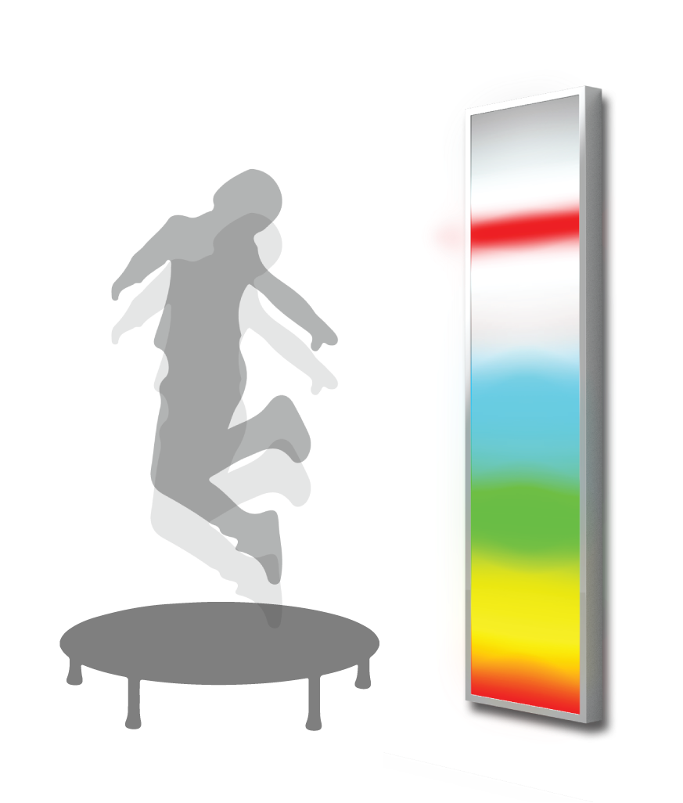

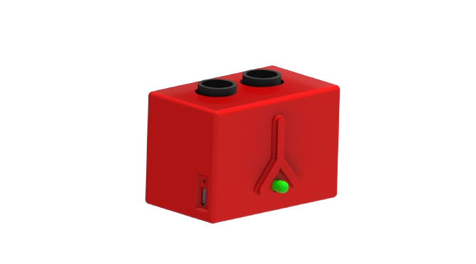

---

specifikacije uređaja - jumpy+ JUMPY SENZOR Aluminijumski ram, Forex ploče, ekstrudirani akril, EVA pena Širina 70 mm Visina 50 mm Dužina 45 mm senzor

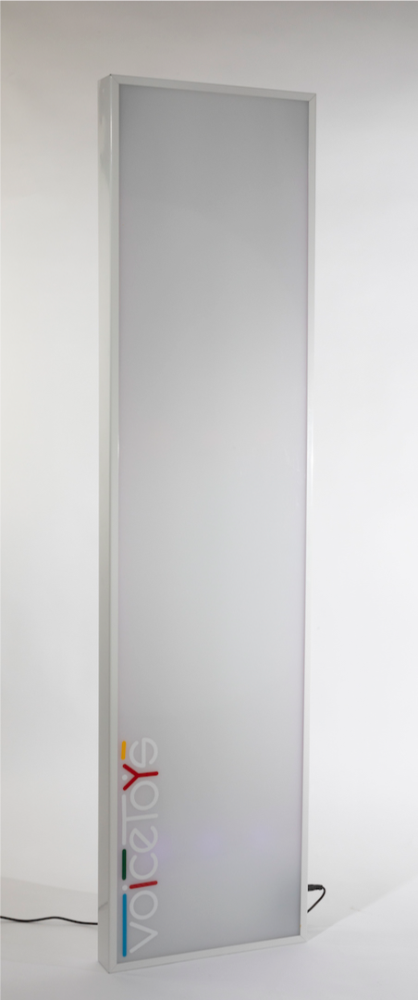

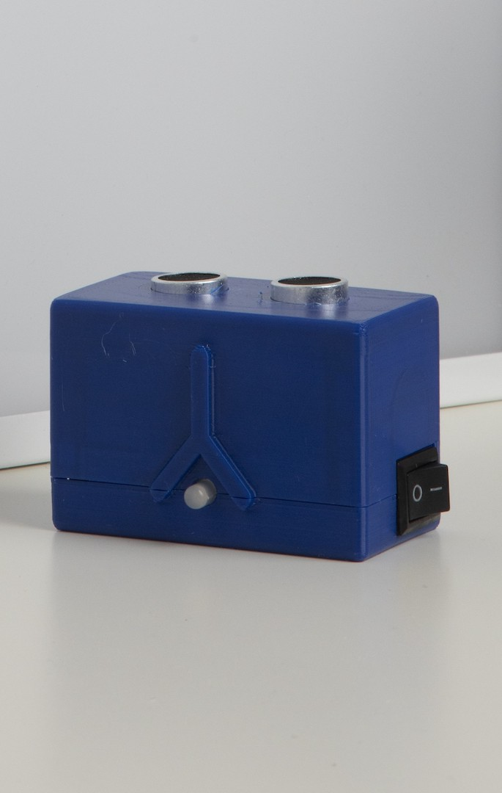

| Napajanje    | DC, 5V, 3A                                                        |
| ------------ | ----------------------------------------------------------------- |
| Konektor     | USB-C                                                             |
| Mreže        | Wi-Fi, Bluetooth                                                  |
| JumpY        | svetlosni panel                                                   |
| Dimenzije    | 1200 mm x 300 mm                                                  |
| Kućište      | Aluminijumski ram, Forex ploče, ekstrudirani akril, EVA pena |
| JumpY senzor | opcioni senzor udaljenosti                                        |
| Dimenzije    | Širina 70 mm Visina 50 mm Dužina 45 mm                  |
| Baterija     | Li-Ion 18650                                                      |
| Kućište      | PET-G                                                             |

---

### 4 -1: Opis sistema i bezbednosne napomene

JumpY je višenamenski svetlosni panel dimenzija 120x30 cm, prevashodno namenjen za audio-vizuelnu i senzo- motornu stimulaciju. Može da reaguje na nivo zvuka koristeći ugrađeni mikrofon izuzetne osetljivosti, a može i da se bežično poveže sa pripadajućim senzorom udaljenosti. Pomoću mobilne aplikacije biraju se njegovi brojni režimi rada.

Svetlosni panel nije predviđen za bilo kakav fizički kontakt sa korisnikom! Nemojte dodirivati niti udarati njegovu svetlosnu površinu!

### 4 - 2: Puštanje sistema u rad

JumpY panel je namenjen za montažu na zid. Uputstvo za montažu se nalazi na sledećoj strani. Ukoliko je potrebno da ga često premeštate, na svoju odgovornost ga možete koristiti i bez pričvršćivanja. JumpY panel je jedini VoiceToys uređaj koji mora biti priključen na električnu mrežu tokom rada. Zbog toga, pre korišćenja se uverite da imate izvor napajanja u blizini. Uređaj se napaja kablom sa USB-C konektorom. Priključak se nalazi sa donje desne strane svetlosnog panela, neposredno ispod prekidača.

Pomoću njega priključite standardni USB adapter, minimum 5V/3A na električnu mrežu. Uključite prekidač. Uređaj se inicijalizuje emitujući crvenu boju. Nakon kratkog perioda inicijalizacije uređaj počinje da radi, i to u onom režimu u kom je radio prilikom prethodne upotrebe.

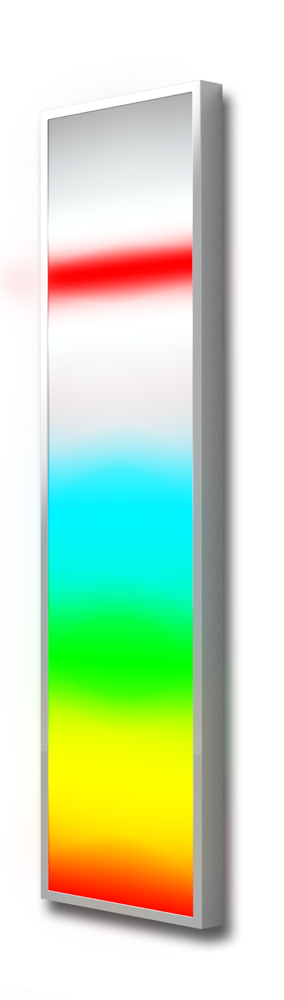

*Detaljne informacije o uređaju: prekidač i USB-C priključak za napajanje.*

---

MONTAŽA uređaja Ukupne dimenzije uređaja su 1200x300 mm.

Uređaj se pričvrćuje pomoću tri šrafa prečnika glave 8mm i tela 5mm, dužine minimum 100 mm.

Prema priloženom dijagramu izbušite rupe na zidu, i u njih tiplovima pričvrstite šrafove ili kuke. Nakon toga, pažljivo postavite uređaj na njih.

Ostavite dovoljno prostora sa donje desne strane za priključak struje i kontrolu prekidača.

Nakon montaže, pričvrstite priložene samolepljive ugaonike na uglove uređaja.

*Ugaonik pričvršćen za uređaj.*

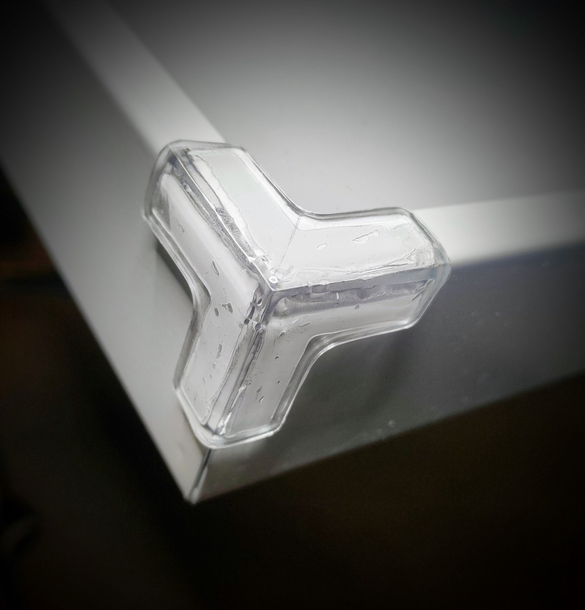

---

### 4 - 3: Funkcije mobilne aplikacije za uređaj JumpY

Biranje režima rada i fina podešavanja uređaja se vrše pomoću aplikacije VoiceToys. Pre nego što pokrenete mobilnu aplikaciju, obavezno uključite uređaj JumpY kako bi se povezao sa aplikacijom. Uređaji (svetlosni panel i senzor distance) se povezuju automatski, bez ikakvog dodatnog podešavanja i reaguju na zvuk odmah nakon uključivanja.

Nakon što uključite uređaj, na početnom ekranu aplikacije (prikazan na strani 7) odaberite opciju "JumpY " kada se njen simbol oboji zelenom bojom. Ukoliko je povezivanje uspešno, svetlosni panel će na kratko emitovati plavo svetlo, a mobilna aplikacija će preuzeti podešavanja uređaja i prikazati vrednosti po kojima on trenutno radi.

U gornjem crvenom polju ekrana aplikacije možete videti naziv uređaja i tastere za informacije o sistemu i pomoć.

Pritiskom na simbol zupčanika u gornjem crvenom polju pristupićete ekranu sa informacijama o uređaju, gde možete videti da li je Vaš uređaj ažuriran, odnosno da li je u njega učitana poslednja verzija softvera.

Možete podesiti i jačinu zvuka kojom će se emitovati reakcije za tačne i netačne odgovore, kao i jačinu svetla koje emituje svetlosni panel.

Pritiskom na bilo koji deo ekrana osenčen sivom bojom se vraćate na ekran za uređaj JumpY.

Pritiskom na simbol znaka pitanja pojaviće se tekst koji će Vam pomoći da se podsetite osnovnih funkcija JumpY aplikacije. Tekst možete pomerati na dole kako bi ga pročitali do kraja. U dnu ekrana se nalazi taster "Pogledaj video".

Pritiskom na ovaj taster ćete pristupiti detaljnom video uputstvu koje će Vam prikazati kompletno uputstvo za korišćenje Vašeg uređaja JumpY.

Pritiskom na taster "X" vraćate se na ekran uređaja JumpY, u onom režimu u kom ste ga prethodno koristili.

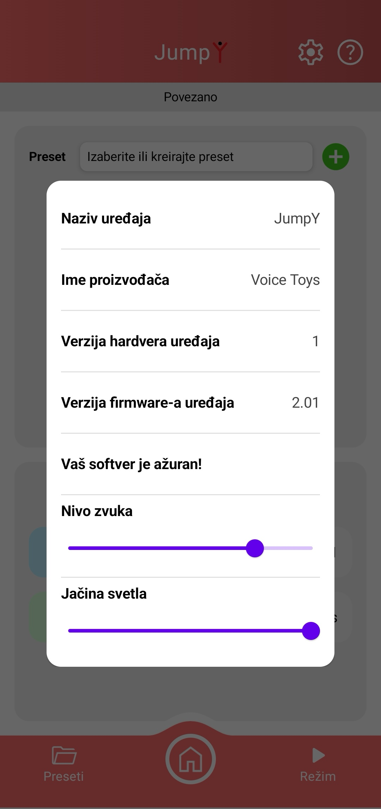

*Funkcije mobilne aplikacije: prikaz ekrana nakon pritiska na simbol zupčanika.*

---

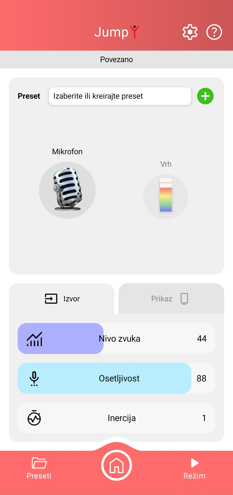

*Izgled ekrana aplikacije: povezanost uređaja, baterija senzora, preset opcije, klizači i izbor režima rada.*

---

### 4 - 4: Režimi rada uređaja JumpY i njihova namena

Svetlosni panel sa senzorom udaljenosti JumpY nudi nekoliko režima rada, sa sledećim predloženim namenama:

### 1 - Režim: Reakcija

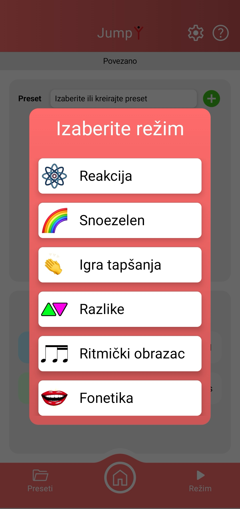

1a - Mikrofon (reakcija na zvuk) Namena: Vizuelna identifikacija nivoa zvuka 1b - Senzor udaljenosti (reakcija na udaljenost) Namena: Vizuelna identifikacija udaljenosti

### 2 - Režim: Snoezelen (korisnik podešava parametre)

Namena: Umirujuće raznobojno svetlo

### 3 - Režim: Igra tapšanja

Namena: Vežba stpljenja, fokusa, grube motorike

### 4 - Režim: Razlike

Namena: Vežba raspoznavanja boja, strpljenja, fokusa

### 5 - Režim: Ritmički obrazac

Namena: Prepoznavanje i ponavljanje ritmičkih obrazaca

### 6 - Režim: Fonetika

Namena: Vežbanje formanata i sibilanata

Izbor režima se vrši pritiskom na taster **"Režim"** koji se nalazi u desnom uglu donjeg crvenog polja ekrana aplikacije. Na slici desno možete videti prikaz ekrana nakon pritiska na taster **"Režim"**. Kada dodirnete natpis sa željenim režimom pojaviće se ekran namenjen detaljnom podešavanju tog režima.

U nastavku su obrazloženi načini pristupa i korišćenja svakog od navedenih režima.

*Režimi rada uređaja JumpY: prikaz ekrana nakon pritiska na taster "Režim".*

---

### Režim: Reakcija

**4-4-1:** Nakon što ste pritiskom na taster **"REŽIM"** ušli u meni za izbor režima rada uređaja, režim vizuelne identifikacije nivoa zvuka i udaljenosti birate pritiskom na taster **"Reakcija"**. Pojaviće se ekran prikazan na strani 27, u čijem gornjem crvenom polju možete videti naziv uređaja i tastere za informacije o sistemu i pomoć. Funkcija i način korišćenja ovih tastera su opisani na strani 26.

U sredini ekrana aplikacije se nalaze slike koje identifikuju trenutni režim rada uređaja (leva) i način prikaza svetlosnog panela (desna slika). Izgled ovog dela ekrana možete videti na donjoj slici.

Leva slika na ekranu prikazuje režim rada uređaja koji je označen rečju "Mikrofon" i odgovarajućim simbolom, sve dok nije uključen senzor udaljenosti. Sa ovim postavkama svetlosni panel reaguje na zvuk. Kada se senzor udaljenosti uključi, svetlosni panel prestaje da reaguje na zvuk i reaguje samo na promenu distance između senzora i objekta, a na ekranu aplikacije je napisano **"Udaljenost"** i odgovarajući simbol. Kada se senzor udaljenosti isključi aplikacija i sve njene funkcije, kao i svetlosni panel, automatski se vraćaju u režim "Mikrofon", odnosno ponovo reaguju na zvuk.

Desna slika koja se nalazi u sredini ekrana aplikacije prikazuje trenutni izgled svetlosnog panela. Kada dodirnete sliku, otvara se prozor (slika dole) u kom možete promeniti izgled svetlosnog panela prema ponuđenim opcijama, na način koji je opisan na sledećoj strani.

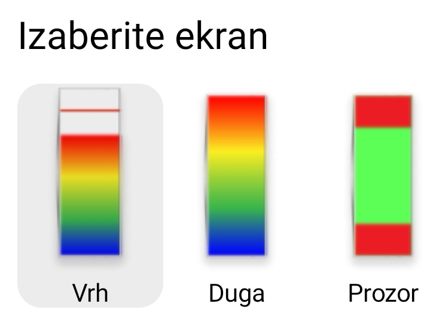

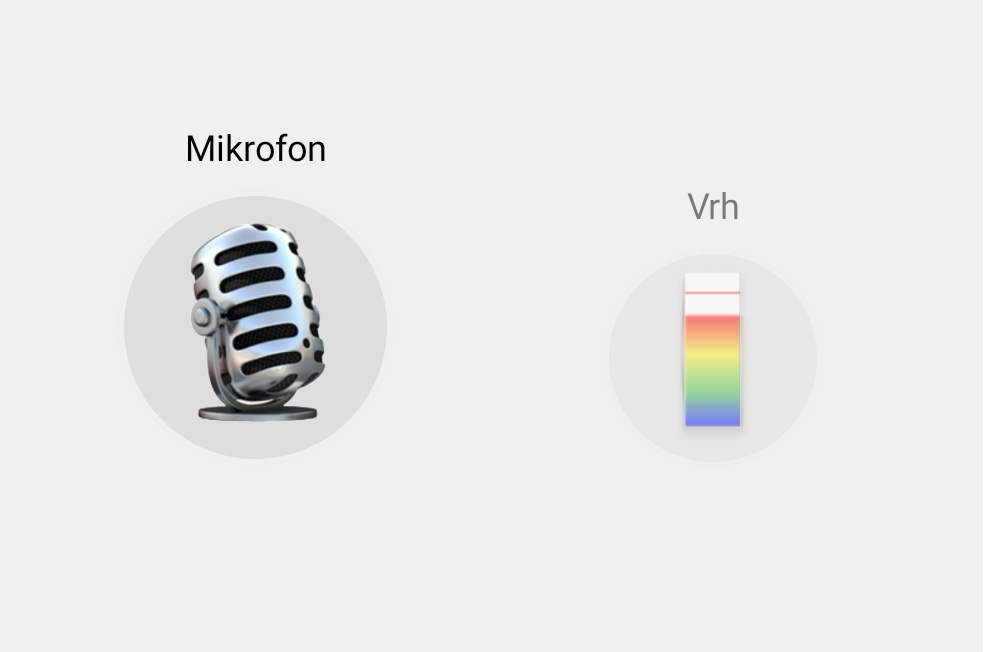

---

### Režim: Reakcija 

Podešavanje nivoa zvuka, osetljivosti i inercije vizuelne reprezentacije zvuka se vrši pomoću klizača koji se nalaze u donjoj polovini ekrana aplikacije, u sekciji **"Izvor"**.

**Nivo zvuka** je prag koji nivo zvuka mora da pređe da bi izazvao svetlosnu reakciju. Zvukovi ispod ovog nivoa su ignorisani. Ukoliko je potrebno, podesite ga prema nivou buke u vašem prostoru tako da se svetlosni panel ne uključuje kada niko ne govori.

**Osetljivost** je osetljivost sistema na promenu nivoa zvuka. Ukoliko ga menjate ka većim vrednostima, sistem postaje osetljiviji, i moguće ga je lakše pobuditi. Pomerajući klizač ka manjim vrednostima, potreban je viši nivo zvuka da bi se uređaj pokrenuo, odnosno da bi se svetla upalila.

**Inercija** predstavlja brzinu reakcije svetlosnog panela na zvučnu pobudu.

Kada uključite senzor udaljenosti, u sekciji "Izvor" se pojavljuje klizač **Raspon**. Njime regulišete osetljivost svetlosnog prikaza na promenu udaljenosti prepreke od senzora udaljenost. Što je manja vrednost na klizaču, svetla na panelu će reagovati brže i više ispunjavati ekran.

Podešavanje prikaza svetala na svetlosnom panelu se vrši pomoću klizača koji se nalaze u donjoj polovini ekrana aplikacije, u sekciji **"Prikaz"**, a funkcije klizača u različitim varijantama prikaza ekrana su: 

**"Duga"** - pomoću klizača Opadanje možete regulisati brzinu opadanja svetlosne reakcije na zvuk.

**"Polja"** - pored klizača Opadanje pojavljuje se klizač **Polja**. Njime određujete u koliko raznobojnih polja će biti podeljen prikaz svetala na svetlosnom panelu.

**"Vrh"** - pojavljuje se Opadanje i još dva klizača. **Opadanje vrha** određuje kojom brzinom će opadati vrh, odnosno crvena linija koja prikazuje maksimalnu postignutu jačinu zvuka. **Zadržavanje vrha** određuje koliko dugo će vrh stajati u mestu pre no što počne da opada niz svetlosni panel.

**"Prozor"** - klizači **Opadanje vrha i Zadržavanje vrha** imaju istu funkciju kao u prethodnom slučaju, a pojam "vrh" se odnosi na belu liniju koja prikazuje nivo zvuka.

Ukoliko promenite parametre nivoa zvuka, osetljivosti, intenziteta svetla ili opadanja, **svoja podešavanja možete zapamtiti** na način koji je opisan na strani 19.

---

### Režim: reakcija - Senzor udaljenosti

Nakon što uključite senzor udaljenosti on će se automatski povezati sa svetlosnim panelom, a ekran aplikacije će izgledati kao na slici desno. Detaljno podešavanje njegovih funkcija je opisano na prethodnoj strani.

Senzor distance uključite nakon što ga postavite na maksimalnu distancu od objekta od kog želite da merite udaljenost. U trenutnku uključenja, senzor meri početnu udaljenost, i sve promene udaljenosti se prikazuju u odnosu na nju.

Postavite ga tako da strana senzora na kojoj se nalaze okrugli otvori bude usmerena ka objektu od kog se meri udaljenost. Na primer: ukoliko senzor udaljenosti postavljate ispod trambuline, dva okrugla otvora koja se nalaze na njemu treba da budu usmerena na gore, kao što je prikazano na slici.

Na ekranu aplikacije možete videti stanje napunjenosti baterije koja se nalazi u senzoru udaljenosti. Nemojte čekati da se baterija potpuno isprazni, nego je napunite priključivanjem USB-C kabla na za to predviđeno mesto koje je na slici dole označeno strelicom.

Uvek se možete vratiti na početni ekran **"VoiceToys"** aplikacije pritiskom na taster sa slikom kućice, koji se nalazi u sredini donjeg crvenog polja ekrana aplikacije.

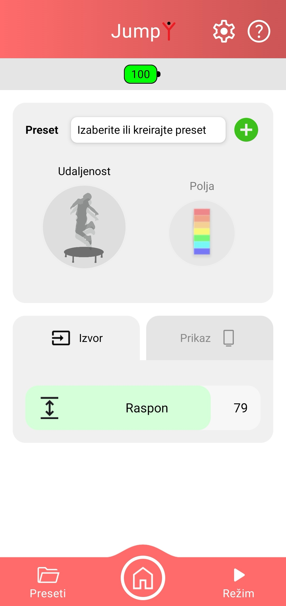

*Prikaz ekrana nakon uključivanja senzora udaljenosti.*

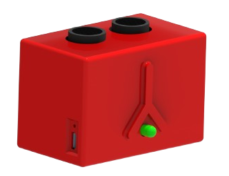

---

### Režim: Snoezelen

**4-4-2:** Nakon što ste pritiskom na taster **"REŽIM"** ušli u meni za izbor režima rada uređaja, režim Snoezelen umirujućeg svetla birate pritiskom na taster **" Snoezelen"**. Pojaviće se ekran prikazan na slici desno, u čijem gornjem crvenom polju možete videti naziv uređaja i tastere za informacije o sistemu i pomoć. Funkcija i način korišćenja ovih tastera su opisani na strani 26.

Podešavanje kombinacije boja, brzine i broja boja koje se prikazuju se vrši pomoću klizača koji se nalaze u donjoj polovini ekrana aplikacije, u sekciji **"Podešavanja"**.

**Šara** predstavlja izbor načina prikaza umirujućeg svetla, odnosno način prikaza kombinacije boja. Postoji 8 načina prikaza boja, koje birate pomoću ovog klizača.

**Brzina** se odnosi na brzinu promene svetala u trenutno izabranom prikazu umirujućeg svetla. Možete je ubrzati ili usporiti.

**Boje** označava broj boja koje će učestvovati u izabranom prikazu umirujućeg svetla.

I**ntenzitet svetla** podešava jačinu sijanja ekrana, ovoj funkciji pristupate na taster zupčanika u gornjem crvenom polju.

Ukoliko promenite parametre nivoa zvuka, osetljivosti ili boje, **svoja podešavanja možete zapamtiti i njima pristupiti** na način koji je opisan na strani 19.

Uvek se možete vratiti na početni ekran **"VoiceToys"** aplikacije pritiskom na taster sa slikom kućice, koji se nalazi u sredini donjeg crvenog polja ekrana aplikacije.

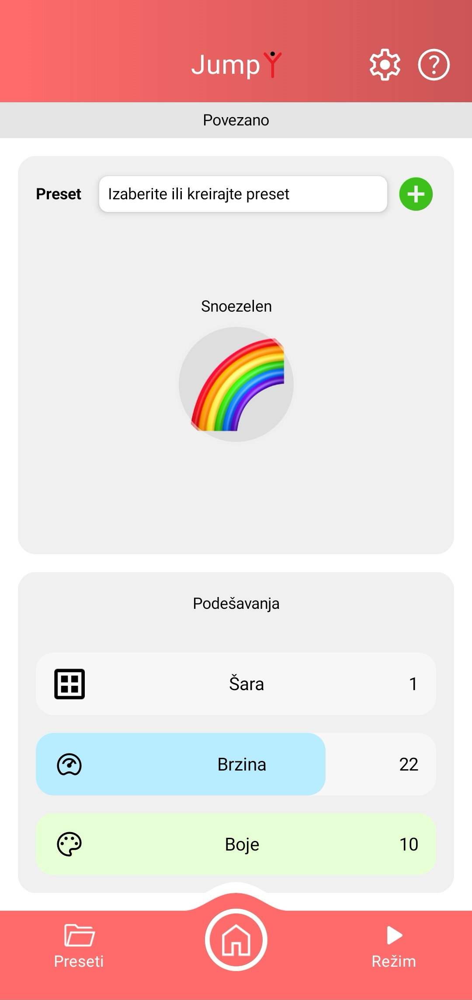

*Prikaz ekrana nakon aktiviranja režima Snoezelen.*

---
### Režim: Igra tapšanja

**4-4-3:** Nakon što ste pritiskom na taster **"REŽIM"** ušli u meni za izbor režima rada uređaja, režim Igra tapšanja birate pritiskom na taster **"Igra tapšanja"**. Pojaviće se ekran prikazan na slici desno, u čijem gornjem crvenom polju možete videti naziv uređaja i tastere za informacije o sistemu i pomoć. Funkcija i način korišćenja ovih tastera su opisani na strani 26.

Podešavanje osetljivosti uređaja na zvuk se vrši pomoću klizača koji se nalaze u donjoj polovini ekrana aplikacije, u sekciji **"Podešavanja"**.

**Osetljivost** predstavlja osetljivost sistema na nagli skok u nivou zvuka. Ovaj nagli skok se izaziva proizvođenjem nekog glasnog, oštrog zvuka - tapšanja, udarom noge o pod, olovke u sto, lopte u pod, udarca u bubanj itd. Više informacija o načinu igranja možete pronaći pritiskom na simbol znaka pitanja, u desnom delu gornjeg crvenog polja.

**Resetuj** je dugme označeno simbolom ↻. Pritiskom na ovaj taster vraćate igru u početni položaj.

**Intenzitet svetla** podešava jačinu sijanja ekrana, ovoj funkciji pristupate na taster zupčanika u gornjem crvenom polju.

Ukoliko promenite parametre nivoa zvuka, osetljivosti ili boje, **svoja podešavanja možete zapamtiti i njima pristupiti** na način koji je opisan na strani 19.

Uvek se možete vratiti na početni ekran **"VoiceToys"** aplikacije pritiskom na taster sa slikom kućice, koji se nalazi u sredini donjeg crvenog polja ekrana aplikacije.

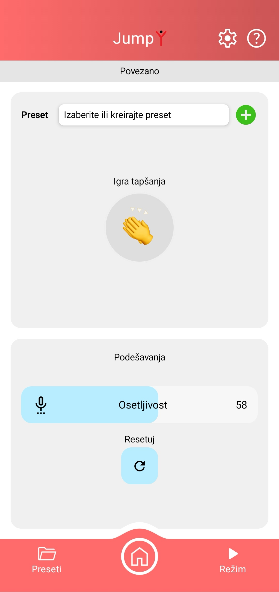

*Prikaz ekrana nakon aktiviranja režima Igra tapšanja.*

---
### Režim: Razlike

**4-4-4:** Nakon što ste pritiskom na taster "REŽIM" ušli u meni za izbor režima rada uređaja, režim Razlike - vežba raspoznavanja boja birate pritiskom na taster **"Razlike"**. Pojaviće se ekran prikazan na slici desno, u čijem gornjem crvenom polju možete videti naziv uređaja i tastere za informacije o sistemu i pomoć. Funkcija i način korišćenja ovih tastera su opisani na strani 26.

Podešavanje osetljivosti uređaja na zvuk se vrši pomoću klizača koji se nalaze u donjoj polovini ekrana aplikacije, u sekciji **"Podešavanja".**

**Osetljivost** predstavlja osetljivost sistema na nagli skok u nivou zvuka. Ovaj nagli skok se izaziva proizvođenjem nekog glasnog, oštrog zvuka - tapšanja, udarom noge o pod, olovke u sto, lopte u pod, udarca u bubanj itd. Više informacija o načinu igranja možete pronaći pritiskom na simbol znaka pitanja, u desnom delu gornjeg crvenog polja.

**Vreme do drugog udara** određuje maksimalan vremenski razmak između dva udara koje sistem registruje kao dvostruki udar.

**Intenzitet svetla** podešava jačinu sijanja ekrana, ovoj funkciji pristupate na taster zupčanika u gornjem crvenom polju.

Ukoliko promenite parametre nivoa zvuka, osetljivosti ili boje, **svoja podešavanja možete zapamtiti i njima pristupiti** na način koji je opisan na strani 19.

Uvek se možete vratiti na početni ekran **"VoiceToys"** aplikacije pritiskom na taster sa slikom kućice, koji se nalazi u sredini donjeg crvenog polja ekrana aplikacije.

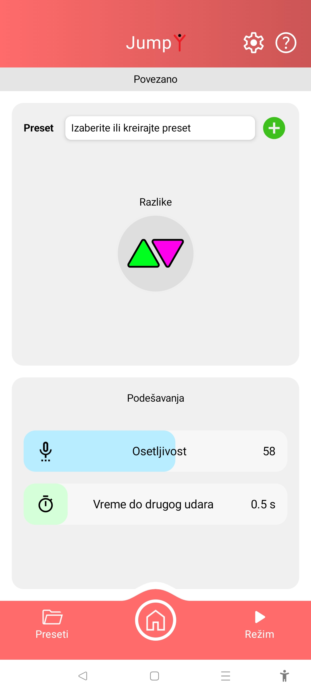

*Prikaz ekrana nakon aktiviranja režima Razlike.*

---
### Režim: Ritmički obrazac

**4-4-5:** Nakon što ste pritiskom na taster **"REŽIM"** ušli u meni za izbor režima rada uređaja, režim Prepoznavanje i ponavljanje ritmičkih obrazaca birate pritiskom na taster **"Ritmički obrazac"**. Pojaviće se ekran prikazan na slici desno, u čijem gornjem crvenom polju možete videti naziv uređaja i tastere za informacije o sistemu i pomoć. Funkcija i način korišćenja ovih tastera su opisani na strani 26.

U srednjem delu ekrana se nalazi taster **Smer** koji određuje u kom smeru će se kretati bela linija.

Podešavanje uređaja se vrši pomoću klizača koji se nalaze u donjoj polovini ekrana aplikacije, u sekciji **"Podešavanja"**.

Na klizaču sa oznakama **Lako-Srednje-Teško** biramo širinu linija čime igraču otežavamo ili olakšavamo zadatak. Pored ovog klizača se nalazi taster sa oznakom ↻ čijim aktiviranjem se igra resetuje i vraća na početak.

**Brzina** predstavlja brzinu kretanja bele linije. Njenim podešavanjem igraču otežavamo ili olakšavamo zadatak.

**Osetljivost** predstavlja osetljivost sistema na nagli skok u nivou zvuka. Ovaj nagli skok se izaziva proizvođenjem nekog glasnog, oštrog zvuka - tapšanja, udarom noge o pod, olovke u sto, lopte u pod, udarca u bubanj itd. Više informacija o načinu igranja možete pronaći pritiskom na simbol znaka pitanja, u desnom delu gornjeg crvenog polja.

**Intenzitet svetla** podešava jačinu sijanja ekrana, ovoj funkciji pristupate na taster zupčanika u gornjem crvenom polju.

Ukoliko promenite neki od parametara **svoja podešavanja možete zapamtiti i njima pristupiti** na način koji je opisan na strani 19.

Uvek se možete vratiti na početni ekran **"VoiceToys"** aplikacije pritiskom na taster sa slikom kućice, koji se nalazi u sredini donjeg crvenog polja ekrana aplikacije.

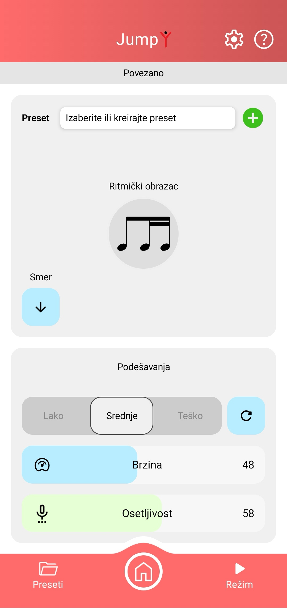

*Prikaz ekrana nakon aktiviranja režima Ritmički obrazac.*

---

### Režim: Fonetika 

**4-4-6:** Nakon što ste pritiskom na taster **"REŽIM"** ušli u meni za izbor režima rada uređaja, režim Fonetika - vežbanje formanata i sibilanata birate pritiskom na taster **"Fonetika"**. Pojaviće se ekran prikazan na slici desno, u čijem gornjem crvenom polju možete videti naziv uređaja i tastere za informacije o sistemu i pomoć. Funkcija i način korišćenja ovih tastera su opisani na strani 26.

U srednjem delu ekrana se nalazi slika koja pokazuje u kom režimu rada se nalazi uređaj.

Podešavanje uređaja se vrši pomoću klizača koji se nalaze u donjoj polovini ekrana aplikacije, u sekciji **"Podešavanja"**.

Na klizaču sa oznakama **Prag formanata** biramo prag koji nivo zvuka mora da pređe da bi izazvao svetlosnu reakciju. Zvukovi ispod ovog nivoa su ignorisani.

Na klizaču sa oznakama **Prag sibilanata** biramo prag koji nivo zvuka mora da pređe da bi izazvao svetlosnu reakciju. Zvukovi ispod ovog nivoa su ignorisani.

**Osetljivost** je osetljivost sistema na promenu nivoa zvuka. Ukoliko ga menjate ka većim vrednostima, sistem postaje osetljiviji, i moguće ga je lakše pobuditi. Pomerajući klizač ka manjim vrednostima, potreban je viši nivo zvuka da bi se uređaj pokrenuo, odnosno da bi se svetla upalila.

**Intenzitet svetla** podešava jačinu sijanja ekrana, ovoj funkciji pristupate na taster zupčanika u gornjem crvenom polju.

Ukoliko promenite neki od parametara **svoja podešavanja možete zapamtiti i njima pristupiti** na način koji je opisan na strani 19.

Uvek se možete vratiti na početni ekran **"VoiceToys"** aplikacije pritiskom na taster sa slikom kućice, koji se nalazi u sredini donjeg crvenog polja ekrana aplikacije.

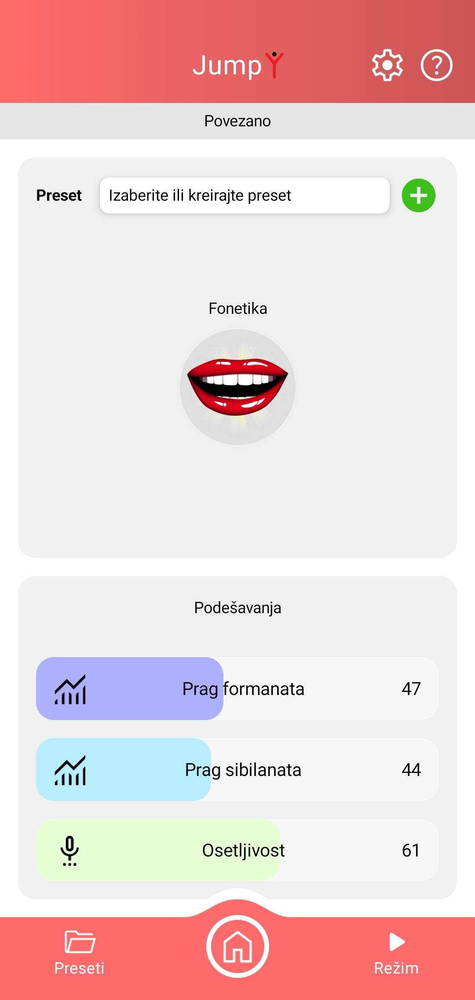

*Prikaz ekrana nakon aktiviranja režima Fonetika.*
