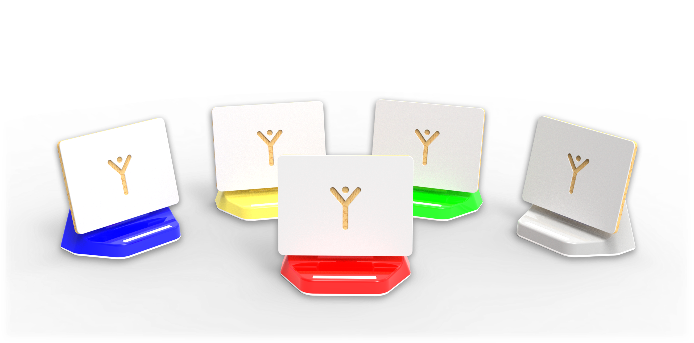
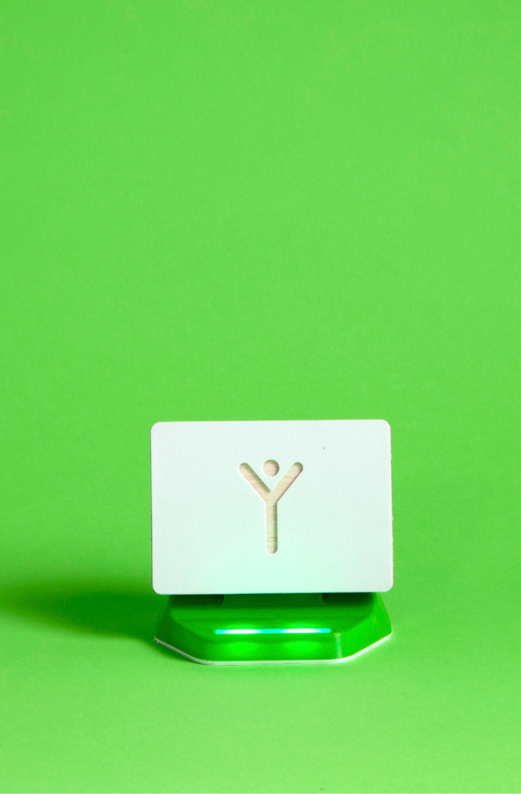
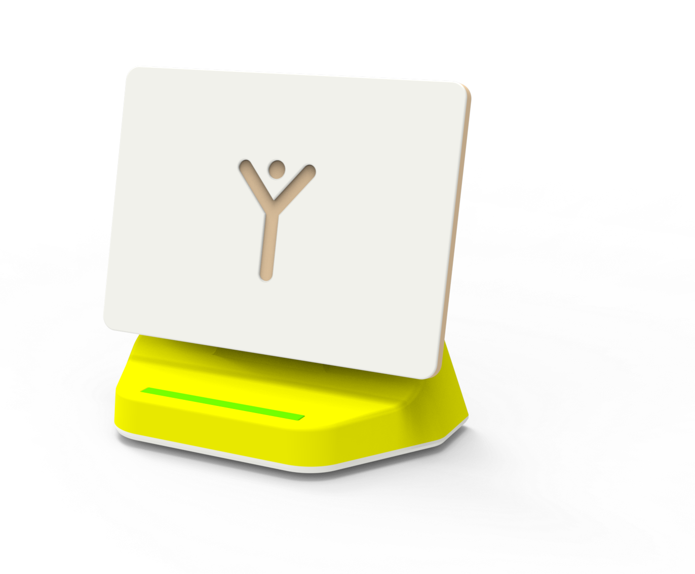
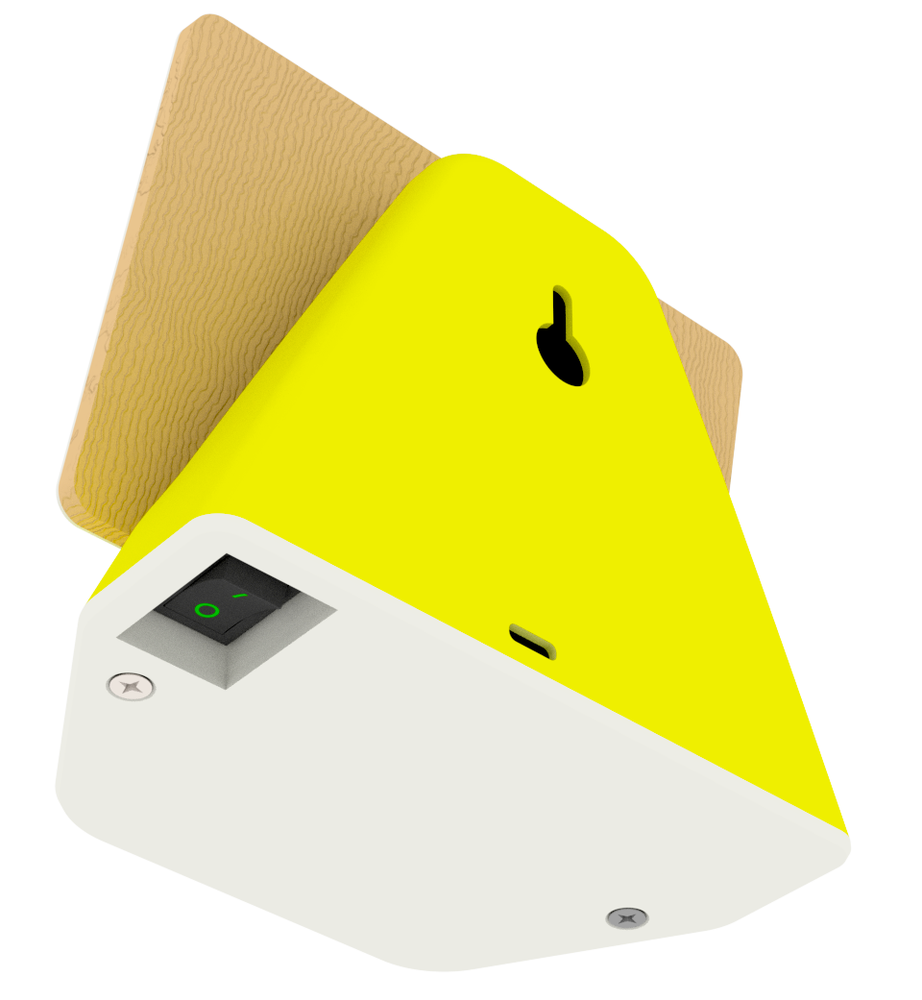
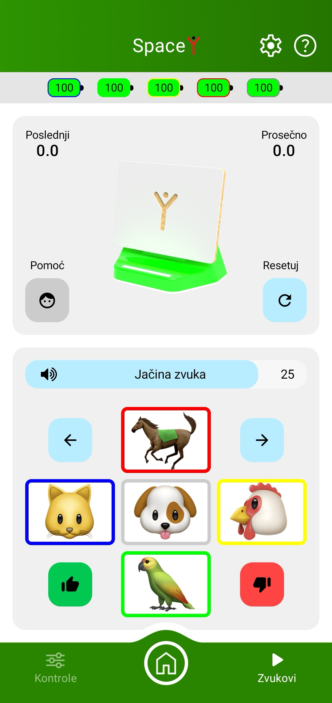
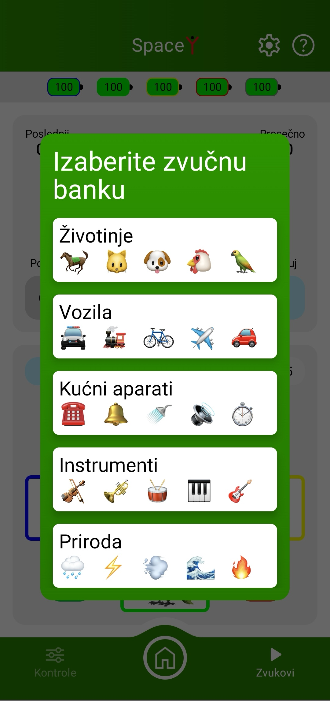

---

### Specifikacije uređaja - SpaceY 

| Napajanje | DC, 5V, 3A                                           |
| --------- | ---------------------------------------------------- |
| Konektor  | USB-C                                                |
| Dimenzije | 120x 73 x 107mm                                      |
| Baterija  | Li-Ion 18650                                         |
| Mreže     | Wi-Fi, Bluetooth                                     |
| Kućište   | PET-G, Balza drvo, Eva pena, ekstrudirani akril |

---

### 5 - 1: Opis sistema i bezbednosne napomene

SpaceY je sistem koji se sastoji od 5 pametnih zvučnika primarno namenjenih uvežbavanju identifikacije i prostorne lokalizacije zvuka kod osoba sa oštećenim sluhom. Povezuju se bežično, a napajaju se pomoću ugrađenih punjivih baterija. Kontrolišu se isključivo **VoiceToys** mobilnom aplikacijom. Emituju lako prepoznatljive zvukove razvrstane u grupe od po pet zvukova.

### 5 - 2: Puštanje u rad

Zvučnici se uključuju postavljanjem prekidača koji se nalazi sa donje strane uređaja u položaj 1. Svetla na zvučnicima počinju da emituju svetlost u boji uređaja. **Neophodno je da plavi zvučnik bude uključen da bi i ostali mogli da funkcionišu!** Nakon uključivanja svih zvučnika, pokrenite mobilnu aplikaciju. Na početnom ekranu aplikacije kliknite na sliku zvučnika kada se pozadina iza njih oboji zelenom bojom. Ukoliko su se zvučnici pravilno povezali, svetla na njima će se ugasiti. To znači da su spremni za rad.

Ukoliko tokom rada svetla počnu da sijaju narandžasto, to znači da je baterija oslabila, a ukoliko počnu da trepere crveno, baterija je na kritično niskom nivou i treba je odmah napuniti. Stanje baterija možete kontrolisati i pomoću mobilne aplikacije.

**Zvučnike NEMOJTE hvatati za rezonantnu ploču - belu tablu od balze i EVA pene sa oznakom! Postoji opasnost da otpadne. Molimo vas da zvučnik hvatate samo za plastično kućište!**

*Detaljne informacije o uređaju SpaceY: prednja strana, indikatorsko svetlo i rezonantna ploča.*

---

### 5 - 3: Montaža i postavljanje u prostoru

Postavite zvučnike u prostor tako da se nalaze ispred, levo, desno, iza, a jedan iznad slušaoca ili grupe sa kojom se radi. U slučaju montaže na zid potrebno je izbušiti rupe u zidu i postaviti u njih šrafove prečnika 6 milimetara, sa zakošenom glavom. Na šrafove zakačite zvučnike pomoću rupe koja se nalazi na zadnjoj strani zvučnika.

### 5 - 4: Punjenje baterije uređaja

Uređaj sadrži Litijum-jonsku bateriju koja se puni naponom od **5V/3A, pomoću USB-C konektora sa zadnje strane uređaja.** Nakon priključenja napona, svetlo indikuje punjenje tako što emituje crvenu, žutu ili zelenu boju, u skladu sa stanjem baterije. Kada svetli konstantno zeleno, proces punjenja je završen. Kada prestanete da radite sa SpaceY zvučnicima, svetla na njima će se upaliti kao podsetnik da ih isključite. Ne ostavljajte ih uključene bez potrebe, kako biste izbegli bespotrebno trošenje baterije.

*Detaljne informacije o uređaju SpaceY: donja i zadnja strana, USB-C priključak, prekidač i otvor za montažu.*

---

*Izgled ekrana aplikacije: grupe zvukova, kontrole reprodukcije, jačina zvuka, indikatori vremena i stanje baterije.*

---

### 5 - 5: Funkcije mobilne aplikacije

Nakon što uključite uređaj, na početnom ekranu aplikacije (prikazan na strani 7) odaberite opciju "SpaceY " kada se njen simbol oboji zelenom bojom. Ukoliko je povezivanje uspešno, svetla na zvučnicima će se ugasiti i oni su spremni za rad.

U gornjem zelenom polju ekrana aplikacije možete videti naziv uređaja i tastere za informacije o sistemu i pomoć. Funkcije ovih tastera su objašnjene na strani 16. Odmah ispod njih se nalazi sekcija u kojoj možete videti stanje napunjenosti baterija za svaki od zvučnika.

U gornjem delu ekrana se nalaze sledeći tasteri:

- u gornjem levom uglu, nalazi **indikacija vremena** koje je proteklo od trenutka aktiviranja određenog zvuka do davanja odgovora. Nakon svakog potvrđenog tačnog odgovora videćete vreme za koje je dat tačan odgovor.Vreme se ponovo aktivira sa aktiviranjem sledećeg zvuka; 

-  u gornjem desnom uglu se nalazi indikacija prosečnog vremena za davanje odgovora na sve zadatke zadate od početka rada aplikacije 

- u donjem levom uglu se nalazi taster za pomoć. Pritiskanjem ovog tastera će se na kratko upaliti svetlo na onom zvučniku iz kojeg dolazi zvuk. Svetlo za pomoć će biti aktivno sve dok ga ne isključite ponovnim pritiskom na taster.

- u donjem desnom uglu se nalazi taster za **resetovanje** oba indikatora vremena.

U donjem delu ekrana se nalaze: 
- klizač za **regulaciju i indikaciju jačine zvuka** koju zvučnici proizvode. Početna vrednost je 25, moguće je pojačati do 30. Pojačavanje ili utišavanje zvuka utiče na sve zvučnike podjednako.

-pet polja sa slikama životinja, uokvirenih bojama koje odgovaraju zvučnicima koja služe za **eimitovanje zvuka**. Kada su zvučnici uključeni, prikazana su samo polja aktivnih zvučnika. Pritiskom na sliku u polju određene boje, odgovarajući zvuk se čuje iz zvučnika u boji polja koje je pritisnuto. U slučaju potrebe možete ponovo emitovati isti zvuk bez uticaja na merenje vremena.

*Funkcije mobilne aplikacije.*

---

- ukoliko želite da promenite raspored zvukova, pritisnite neku od strelica ⬅️ ili ➡️koje se nalaze iznad plavog, odnosno žutog polja. Slike će zameniti mesta, i zvučnici će reagovati prema novom rasporedu.

- na pozicijama ispod plavog i žutog polja se nalaze polja zelene 👍 i  crvene 👎 boje koja služe za **ocenjivanje odgovora**. Tačan odgovor se ocenjuje pritiskom na zeleno, a netačan na crveno polje. Tom prilikom će se čuti karakteristični zvuci odobravanja zajedno sa šarenim svetlima koja emituje zvučnik iz kog je dolazio zadati zvuk za tačne, ili zvuk neodobravanja zajedno sa crvenim svetlom koje emituju svi zvučnici za netačne odgovore. Na tasterima će se pojaviti brojevi koji označavaju broj datih tačnih, odnosno pogrešnih odgovora.

U donjem zelenom polju ekrana se nalazi taster "**Režim**".Pritiskom na ovaj taster će se pojaviti grupe zvukova koje možete da izaberete (životinje, vozila, kućni aparati, instrumenti i priroda). Izborom neke od grupa zvukova slike u donjem delu ekrana će se promeniti i pojaviće se slike iz grupe zvukova koje ste odabrali. Pritiskom na slike će se emitovati novi zvukovi koji odgovaraju slikama.

Pritiskom na taster sa simbolom kućice se vraćate na početni ekran **VoiceToys** aplikacije gde možete izabrati neki drugi uređaj iz sistema **VoiceToys** sa kojim želite da nastavite rad.

*Detaljne informacije o uređaju i izgled ekrana nakon pritiska na taster "Režim".*
